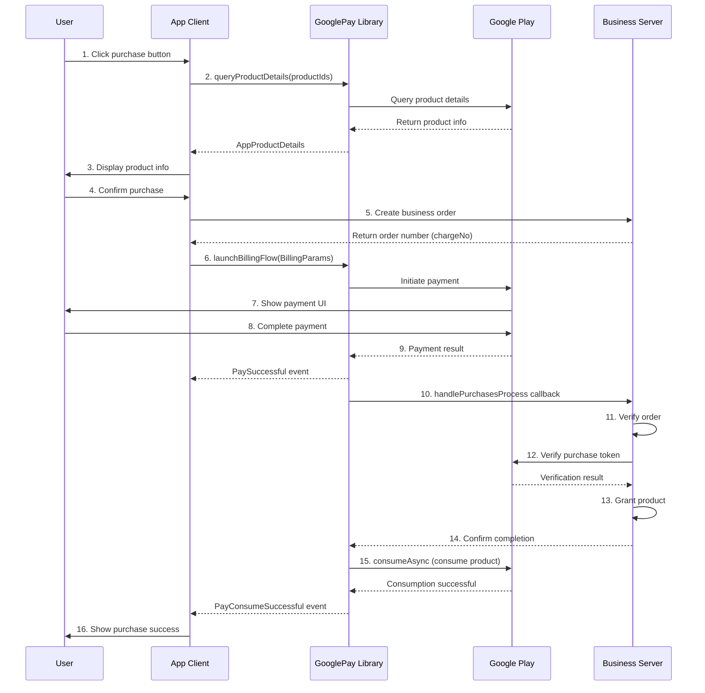

# GooglePay Consumable Product Purchase Flow

This document provides a detailed guide on implementing the complete purchase flow for one-time consumable products using the GooglePay library.

## 1. Overview

### 1.1 What are Consumable Products

Consumable products are items that users can purchase, use within the app, and then consume. After consumption, they can be purchased again. Common consumable products include:

- Game coins, gold
- Game items, equipment
- In-app currency
- One-time use power-ups

### 1.2 Characteristics of Consumable Products

- **Repeatable Purchase**: Can be purchased again after consumption
- **Requires Consumption**: Must call `consumeAsync` after successful purchase
- **Library Auto-handling**: GooglePay library automatically handles consumption logic
- **Server Verification**: Recommended to verify orders on the server before granting products

## 2. Prerequisites

### 2.1 Google Play Console Configuration

1. Log in to [Google Play Console](https://play.google.com/console)
2. Select your app
3. Navigate to **In-app products** → **Manage products**
4. Click **Create product** to create a consumable product
5. Fill in product information:
   - **Product ID**: Unique identifier (e.g., `com.example.product.coin_100`)
   - **Name**: Product display name
   - **Description**: Product description
   - **Price**: Set prices for different countries/regions
   - **Status**: Set to "Active"

### 2.2 Application Initialization Configuration

Initialize GooglePayClient in your `Application` class:

```kotlin
class App : Application(), GooglePayService {
    
    override fun onCreate() {
        super.onCreate()
        
        GooglePayClient.getInstance()
            .initBillingClient(this, this)
            .setDebug(true)  // Enable debug logging in development
            .setSubscription(false)  // No subscription support
            .setInterval(15)  // Auto-refresh interval 15 seconds
            .registerActivitys(listOf(MainActivity::class.java))
    }
    
    // Implement GooglePayService interface
    override fun getOneTimeConsumableProducts(): List<String> {
        return listOf(
            "com.example.product.coin_100",
            "com.example.product.coin_500",
            "com.example.product.coin_1000"
        )
    }
    
    override fun getOneTimeNonConsumableProducts(): List<String> {
        return emptyList()  // If no non-consumable products
    }
    
    override fun getSubscribeProducts(): List<String> {
        return emptyList()  // No subscription support
    }
    
    override fun handlePurchasesProcess(
        isPay: Boolean,
        productType: BillingProductType,
        purchases: Purchase
    ) {
        // Handle purchase verification logic (see following sections)
    }
}
```

## 3. Complete Purchase Flow

### Flow Diagram



### Step 1: Query Product Details

Before displaying the product list, query detailed product information (price, name, etc.).

```kotlin
class ProductViewModel : ViewModel() {
    
    private val oneTimeService = GooglePayClient.getInstance()
        .getPayService<OneTimeService>()
    
    private val _products = MutableLiveData<List<AppProductDetails>>()
    val products: LiveData<List<AppProductDetails>> = _products
    
    fun loadProducts() {
        viewModelScope.launch {
            val productIds = listOf(
                "com.example.product.coin_100",
                "com.example.product.coin_500",
                "com.example.product.coin_1000"
            )
            
            oneTimeService.queryProductDetails(productIds).collect { result ->
                result.onSuccess { productList ->
                    _products.value = productList
                    Log.d("Products", "Loaded successfully: ${productList.size} products")
                }
                result.onFailure { error ->
                    Log.e("Products", "Load failed: ${error.message}")
                }
            }
        }
    }
}
```

**AppProductDetails Field Description:**

| Field | Type | Description |
|------|------|------|
| `productId` | String | Product ID |
| `productName` | String | Product name |
| `formattedPrice` | String | Formatted price (e.g., "€7.99") |
| `priceAmountMicros` | Long | Price in micros |
| `priceCurrencyCode` | String | Currency code (e.g., "EUR") |

### Step 2: Initiate Purchase

After the user clicks the purchase button, build purchase parameters and initiate the payment flow.

```kotlin
class InAppFragment : Fragment() {
    
    private val oneTimeService = GooglePayClient.getInstance()
        .getPayService<OneTimeService>()
    
    private fun onProductClick(productId: String) {
        lifecycleScope.launch {
            // 1. Create business order on server first, get order number
            val chargeNo = createBusinessOrder(productId)
            
            // 2. Build payment parameters
            val billingParams = BillingParams.Builder()
                .setAccountId("user_12345")  // User unique identifier
                .setProductId(productId)     // Product ID
                .setChargeNo(chargeNo)       // Business order number
                .build()
            
            // 3. Initiate payment
            val result = oneTimeService.launchBillingFlow(
                requireActivity(),
                billingParams
            )
            
            // 4. Handle return result
            when (result.code) {
                AppBillingResponseCode.OK -> {
                    Log.d("Pay", "Payment flow initiated")
                }
                AppBillingResponseCode.USER_CANCELED -> {
                    showToast("User canceled payment")
                }
                AppBillingResponseCode.BILLING_UNAVAILABLE -> {
                    showToast("Google Play Billing not supported on this device")
                }
                AppBillingResponseCode.ITEM_ALREADY_OWNED -> {
                    showToast("You already own this item, please consume first")
                }
                else -> {
                    showToast("Payment failed: ${result.message}")
                }
            }
        }
    }
    
    private suspend fun createBusinessOrder(productId: String): String {
        // Call business server API to create order
        // Return order number
        return "ORDER_${System.currentTimeMillis()}"
    }
}
```

**BillingParams Parameter Description:**

| Parameter | Type | Required | Description |
|------|------|------|------|
| `accountId` | String | Yes | User unique identifier (obfuscatedAccountId) |
| `productId` | String | Yes | Google Play product ID |
| `chargeNo` | String | Yes | Business order number (obfuscatedProfileId) |

### Step 3: Listen for Payment Events

Use `observePayEvent` or `appBillingPayEventFlow` to listen for payment results.

**Using observePayEvent Extension Function (Recommended)**

```kotlin
class InAppFragment : Fragment() {
    
    override fun onViewCreated(view: View, savedInstanceState: Bundle?) {
        super.onViewCreated(view, savedInstanceState)
        
        // Listen for payment events
        observePayEvent { event ->
            when (event) {
                is BillingPayEvent.PaySuccessful -> {
                    // Payment successful (waiting for server verification and consumption)
                    Log.d("Pay", "Payment successful: ${event.purchase.orderId}")
                    showLoading("Processing order...")
                }
                
                is BillingPayEvent.PayConsumeSuccessful -> {
                    // Payment and consumption successful (final success state)
                    hideLoading()
                    showToast("Purchase successful!")
                    refreshUserBalance()  // Refresh user balance
                }
                
                is BillingPayEvent.PayFailed -> {
                    // Payment failed
                    hideLoading()
                    showToast("Payment failed: ${event.message}")
                    Log.e("Pay", "Payment failed: code=${event.code}, msg=${event.message}")
                }
                
                is BillingPayEvent.PayConsumeFailed -> {
                    // Payment successful but consumption failed (need to retry consumption)
                    hideLoading()
                    showToast("Order processing error, please contact support")
                    Log.e("Pay", "Consumption failed: ${event.purchase.orderId}")
                }
            }
        }
    }
}
```

### Step 4: Server Verification

Implement order verification logic in `GooglePayService.handlePurchasesProcess()`.

```kotlin
class App : Application(), GooglePayService {
    
    override fun handlePurchasesProcess(
        isPay: Boolean,
        productType: BillingProductType,
        purchases: Purchase
    ) {
        // isPay: true means new purchase, false means queried historical order
        if (!isPay) return
        
        // Process in background thread
        CoroutineScope(Dispatchers.IO).launch {
            try {
                // 1. Extract order information
                val productId = purchases.products.firstOrNull() ?: return@launch
                val purchaseToken = purchases.purchaseToken
                val orderId = purchases.orderId
                val accountId = purchases.accountIdentifiers?.obfuscatedAccountId
                val chargeNo = purchases.accountIdentifiers?.obfuscatedProfileId
                
                Log.d("Purchase", "Processing order: orderId=$orderId, productId=$productId")
                
                // 2. Call business server to verify order
                val verifyResult = verifyPurchaseOnServer(
                    productId = productId,
                    purchaseToken = purchaseToken,
                    orderId = orderId,
                    chargeNo = chargeNo,
                    accountId = accountId
                )
                
                if (verifyResult.success) {
                    // 3. Verification successful, server will grant product
                    Log.d("Purchase", "Order verified successfully, product granted")
                    
                    // 4. Library will automatically call consumeAsync to consume product
                    // No manual handling needed
                } else {
                    Log.e("Purchase", "Order verification failed: ${verifyResult.message}")
                    // Verification failed, don't consume product
                }
                
            } catch (e: Exception) {
                Log.e("Purchase", "Order processing exception", e)
            }
        }
    }
    
    private suspend fun verifyPurchaseOnServer(
        productId: String,
        purchaseToken: String,
        orderId: String?,
        chargeNo: String?,
        accountId: String?
    ): VerifyResult {
        // Call business server API to verify order
        // Server should:
        // 1. Verify purchaseToken validity (call Google Play Developer API)
        // 2. Check if order has been processed (prevent duplicate grants)
        // 3. Grant product to user
        // 4. Return verification result
        
        return withContext(Dispatchers.IO) {
            // Example code
            val response = apiService.verifyPurchase(
                productId, purchaseToken, orderId, chargeNo, accountId
            )
            VerifyResult(response.success, response.message)
        }
    }
    
    data class VerifyResult(val success: Boolean, val message: String)
}
```

### Step 5: Product Consumption

**Important**: GooglePay library automatically handles consumption logic, developers don't need to manually call `consumeAsync`.

Consumption flow:

1. After user completes payment, Google Play returns purchase token
2. Library triggers `handlePurchasesProcess` callback
3. Business server verifies order and grants product
4. Library automatically calls `consumeAsync` to consume product
5. After successful consumption, triggers `PayConsumeSuccessful` event

## 4. Complete Code Example

### Fragment Complete Implementation

```kotlin
class InAppFragment : Fragment() {
    
    private var _binding: FragmentInappBinding? = null
    private val binding get() = _binding!!
    
    private val viewModel by viewModels<InAppViewModel>()
    private val adapter = ProductAdapter()
    
    private val oneTimeService = GooglePayClient.getInstance()
        .getPayService<OneTimeService>()
    
    override fun onCreateView(
        inflater: LayoutInflater,
        container: ViewGroup?,
        savedInstanceState: Bundle?
    ): View {
        _binding = FragmentInappBinding.inflate(inflater, container, false)
        return binding.root
    }
    
    override fun onViewCreated(view: View, savedInstanceState: Bundle?) {
        super.onViewCreated(view, savedInstanceState)
        
        setupRecyclerView()
        observeProducts()
        observePayEvents()
        
        // Load product list
        viewModel.loadProducts()
    }
    
    private fun setupRecyclerView() {
        binding.recyclerView.apply {
            layoutManager = GridLayoutManager(requireContext(), 2)
            adapter = this@InAppFragment.adapter
        }
        
        adapter.setOnItemClickListener { product ->
            purchaseProduct(product.productId)
        }
    }
    
    private fun observeProducts() {
        viewModel.products.observe(viewLifecycleOwner) { products ->
            adapter.submitList(products)
        }
    }
    
    private fun observePayEvents() {
        observePayEvent { event ->
            when (event) {
                is BillingPayEvent.PaySuccessful -> {
                    showLoading("Processing order...")
                }
                
                is BillingPayEvent.PayConsumeSuccessful -> {
                    hideLoading()
                    showToast("Purchase successful!")
                    viewModel.refreshUserBalance()
                }
                
                is BillingPayEvent.PayFailed -> {
                    hideLoading()
                    showToast("Payment failed: ${event.message}")
                }
                
                is BillingPayEvent.PayConsumeFailed -> {
                    hideLoading()
                    showToast("Order processing error, please contact support")
                }
            }
        }
    }
    
    private fun purchaseProduct(productId: String) {
        lifecycleScope.launch {
            try {
                // 1. Create business order
                val chargeNo = viewModel.createOrder(productId)
                
                // 2. Build payment parameters
                val params = BillingParams.Builder()
                    .setAccountId(viewModel.getUserId())
                    .setProductId(productId)
                    .setChargeNo(chargeNo)
                    .build()
                
                // 3. Initiate payment
                val result = oneTimeService.launchBillingFlow(
                    requireActivity(),
                    params
                )
                
                // 4. Handle result
                if (result.code != AppBillingResponseCode.OK) {
                    showToast(result.message)
                }
                
            } catch (e: Exception) {
                showToast("Purchase failed: ${e.message}")
            }
        }
    }
    
    override fun onDestroyView() {
        super.onDestroyView()
        _binding = null
    }
}
```

### ViewModel Implementation

```kotlin
class InAppViewModel : ViewModel() {
    
    private val oneTimeService = GooglePayClient.getInstance()
        .getPayService<OneTimeService>()
    
    private val _products = MutableLiveData<List<AppProductDetails>>()
    val products: LiveData<List<AppProductDetails>> = _products
    
    fun loadProducts() {
        viewModelScope.launch {
            val productIds = listOf(
                "com.example.product.coin_100",
                "com.example.product.coin_500",
                "com.example.product.coin_1000"
            )
            
            oneTimeService.queryProductDetails(productIds).collect { result ->
                result.onSuccess { _products.value = it }
                result.onFailure { Log.e("VM", "Load failed", it) }
            }
        }
    }
    
    suspend fun createOrder(productId: String): String {
        return withContext(Dispatchers.IO) {
            // Call server API to create order
            "ORDER_${System.currentTimeMillis()}"
        }
    }
    
    fun getUserId(): String {
        // Get current user ID
        return "user_12345"
    }
    
    fun refreshUserBalance() {
        // Refresh user balance
    }
}
```

## 5. Error Handling

### Common Error Code Handling

```kotlin
fun handleBillingError(code: Int, message: String) {
    when (code) {
        AppBillingResponseCode.OK -> {
            // Success
        }
        AppBillingResponseCode.USER_CANCELED -> {
            showToast("You canceled the payment")
        }
        AppBillingResponseCode.ITEM_ALREADY_OWNED -> {
            showToast("You already own this item, processing...")
            // Can try to query and consume owned products
            queryAndConsumeOwnedProducts()
        }
        AppBillingResponseCode.BILLING_UNAVAILABLE -> {
            showToast("Google Play Billing not supported on this device")
        }
        AppBillingResponseCode.SERVICE_UNAVAILABLE -> {
            showToast("Google Play service temporarily unavailable, please try again later")
        }
        AppBillingResponseCode.NETWORK_ERROR -> {
            showToast("Network error, please check your connection")
        }
        AppBillingResponseCode.DEVELOPER_ERROR -> {
            Log.e("Billing", "Developer error: $message")
            showToast("Payment configuration error, please contact support")
        }
        else -> {
            showToast("Payment failed: $message")
        }
    }
}
```

### Handling Already Owned Products

If the user has already purchased but not consumed a product, you can query and handle it:

```kotlin
fun queryAndConsumeOwnedProducts() {
    lifecycleScope.launch {
        // Calling queryPurchases will trigger the library's automatic processing flow
        GooglePayClient.getInstance().queryPurchases()
        
        // Library will automatically:
        // 1. Query all unconsumed purchases
        // 2. Trigger handlePurchasesProcess callback
        // 3. Verify and consume products
    }
}
```

## 6. FAQ

### Q1: What if a product is already owned but not consumed?

**A**: Call `GooglePayClient.getInstance().queryPurchases()`, the library will automatically query and process unconsumed products.

### Q2: How to test the purchase flow?

**A**:

1. Add test accounts in Google Play Console
2. Log in to the device with a test account
3. Purchase will show "This is a test purchase" prompt
4. Test purchases won't charge real money

### Q3: How to handle consumption failure?

**A**:

- Library will trigger `PayConsumeFailed` event
- Can retry later by calling `queryPurchases()`
- Recommend recording consumption status on server to avoid duplicate grants

### Q4: How to prevent duplicate product grants?

**A**:

- Use `orderId` or `purchaseToken` for idempotency check on server
- Record processed orders to avoid duplicate processing

### Q5: What if payment succeeds but server verification fails?

**A**:

- Product won't be consumed
- Next time user launches app, library will automatically re-verify
- Recommend providing order query interface on server for manual order补单

## 7. Best Practices

1. **Order Number Management**: Create business order before initiating payment, use order number to associate with Google Play order
2. **Server Verification**: Always verify purchase tokens on server, don't rely solely on client
3. **Idempotency**: Ensure server order processing is idempotent to avoid duplicate grants
4. **Error Handling**: Comprehensive error handling and user prompts
5. **Logging**: Log key steps for troubleshooting
6. **Testing**: Thoroughly test various exception scenarios (network errors, payment cancellation, duplicate purchases, etc.)

## 8. Related Documentation

- [API Documentation](./API_DOCS.md)
- [Subscription Purchase Flow](./SUBSCRIPTION_PURCHASE_FLOW.md)
- [Google Play Billing Official Documentation](https://developer.android.com/google/play/billing)
