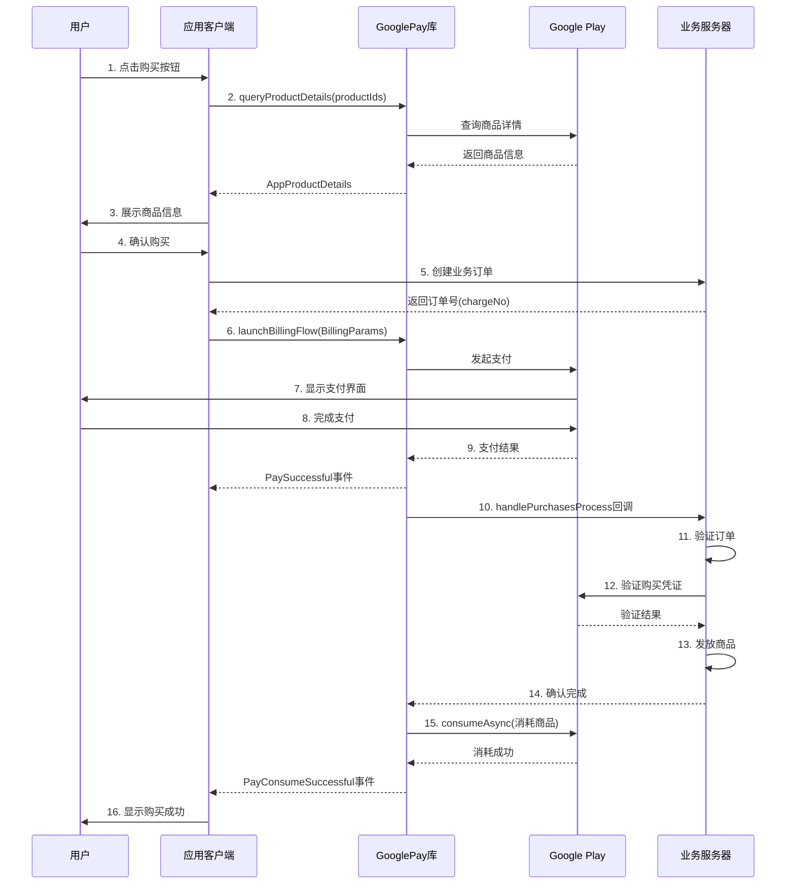

# GooglePay 消耗商品购买流程

本文档详细介绍如何使用 GooglePay 库实现一次性消耗商品的完整购买流程。

## 1. 概述

### 1.1 什么是消耗型商品

消耗型商品是指用户购买后可以在应用内使用并消耗的商品，消耗后可以再次购买。常见的消耗型商品包括：

- 游戏币、金币
- 游戏道具、装备
- 应用内货币
- 一次性使用的增益道具

### 1.2 消耗型商品的特点

- **可重复购买**: 消耗后可以再次购买
- **需要消耗**: 购买成功后必须调用 `consumeAsync` 进行消耗
- **库自动处理**: GooglePay 库会自动处理消耗逻辑
- **服务端验证**: 建议在服务端验证订单后再发放商品

## 2. 前置准备

### 2.1 Google Play Console 配置

1. 登录 [Google Play Console](https://play.google.com/console)
2. 选择您的应用
3. 导航到 **应用内商品** → **管理商品**
4. 点击 **创建商品** 创建消耗型商品
5. 填写商品信息：
   - **商品 ID**: 唯一标识符（例如：`com.example.product.coin_100`）
   - **名称**: 商品显示名称
   - **说明**: 商品描述
   - **价格**: 设置各个国家/地区的价格
   - **状态**: 设置为"有效"

### 2.2 应用初始化配置

在 `Application` 类中初始化 GooglePayClient：

```kotlin
class App : Application(), GooglePayService {
    
    override fun onCreate() {
        super.onCreate()
        
        GooglePayClient.getInstance()
            .initBillingClient(this, this)
            .setDebug(true)  // 开发环境开启调试日志
            .setSubscription(false)  // 不支持订阅
            .setInterval(15)  // 自动刷新间隔 15 秒
            .registerActivitys(listOf(MainActivity::class.java))
    }
    
    // 实现 GooglePayService 接口
    override fun getOneTimeConsumableProducts(): List<String> {
        return listOf(
            "com.example.product.coin_100",
            "com.example.product.coin_500",
            "com.example.product.coin_1000"
        )
    }
    
    override fun getOneTimeNonConsumableProducts(): List<String> {
        return emptyList()  // 如果没有非消耗型商品
    }
    
    override fun getSubscribeProducts(): List<String> {
        return emptyList()  // 不支持订阅
    }
    
    override fun handlePurchasesProcess(
        isPay: Boolean,
        productType: BillingProductType,
        purchases: Purchase
    ) {
        // 处理购买验证逻辑（见后续章节）
    }
}
```

## 3. 完整购买流程

### 流程图



### 步骤 1: 查询商品详情

在展示商品列表前，需要先查询商品的详细信息（价格、名称等）。

```kotlin
class ProductViewModel : ViewModel() {
    
    private val oneTimeService = GooglePayClient.getInstance()
        .getPayService<OneTimeService>()
    
    private val _products = MutableLiveData<List<AppProductDetails>>()
    val products: LiveData<List<AppProductDetails>> = _products
    
    fun loadProducts() {
        viewModelScope.launch {
            val productIds = listOf(
                "com.example.product.coin_100",
                "com.example.product.coin_500",
                "com.example.product.coin_1000"
            )
            
            oneTimeService.queryProductDetails(productIds).collect { result ->
                result.onSuccess { productList ->
                    _products.value = productList
                    Log.d("Products", "加载成功: ${productList.size} 个商品")
                }
                result.onFailure { error ->
                    Log.e("Products", "加载失败: ${error.message}")
                }
            }
        }
    }
}
```

**AppProductDetails 字段说明:**

| 字段 | 类型 | 说明 |
|------|------|------|
| `productId` | String | 商品 ID |
| `productName` | String | 商品名称 |
| `formattedPrice` | String | 格式化的价格（如 "€7.99"） |
| `priceAmountMicros` | Long | 价格的微单位值 |
| `priceCurrencyCode` | String | 货币代码（如 "EUR"） |

### 步骤 2: 发起购买

用户点击购买按钮后，构建购买参数并发起支付流程。

```kotlin
class InAppFragment : Fragment() {
    
    private val oneTimeService = GooglePayClient.getInstance()
        .getPayService<OneTimeService>()
    
    private fun onProductClick(productId: String) {
        lifecycleScope.launch {
            // 1. 先向业务服务器创建订单，获取订单号
            val chargeNo = createBusinessOrder(productId)
            
            // 2. 构建支付参数
            val billingParams = BillingParams.Builder()
                .setAccountId("user_12345")  // 用户唯一标识
                .setProductId(productId)     // 商品 ID
                .setChargeNo(chargeNo)       // 业务订单号
                .build()
            
            // 3. 发起支付
            val result = oneTimeService.launchBillingFlow(
                requireActivity(),
                billingParams
            )
            
            // 4. 处理返回结果
            when (result.code) {
                AppBillingResponseCode.OK -> {
                    Log.d("Pay", "支付流程已启动")
                }
                AppBillingResponseCode.USER_CANCELED -> {
                    showToast("用户取消了支付")
                }
                AppBillingResponseCode.BILLING_UNAVAILABLE -> {
                    showToast("当前设备不支持 Google Play 支付")
                }
                AppBillingResponseCode.ITEM_ALREADY_OWNED -> {
                    showToast("您已拥有该商品，请先消耗")
                }
                else -> {
                    showToast("支付失败: ${result.message}")
                }
            }
        }
    }
    
    private suspend fun createBusinessOrder(productId: String): String {
        // 调用业务服务器 API 创建订单
        // 返回订单号
        return "ORDER_${System.currentTimeMillis()}"
    }
}
```

**BillingParams 参数说明:**

| 参数 | 类型 | 必填 | 说明 |
|------|------|------|------|
| `accountId` | String | 是 | 用户唯一标识（obfuscatedAccountId） |
| `productId` | String | 是 | Google Play 商品 ID |
| `chargeNo` | String | 是 | 业务订单号（obfuscatedProfileId） |

### 步骤 3: 监听支付事件

使用 `observePayEvent` 或 `appBillingPayEventFlow` 监听支付结果。

**使用 observePayEvent 扩展函数（推荐）**

```kotlin
class InAppFragment : Fragment() {
    
    override fun onViewCreated(view: View, savedInstanceState: Bundle?) {
        super.onViewCreated(view, savedInstanceState)
        
        // 监听支付事件
        observePayEvent { event ->
            when (event) {
                is BillingPayEvent.PaySuccessful -> {
                    // 支付成功（等待服务端验证和消耗）
                    Log.d("Pay", "支付成功: ${event.purchase.orderId}")
                    showLoading("正在处理订单...")
                }
                
                is BillingPayEvent.PayConsumeSuccessful -> {
                    // 支付并消耗成功（最终成功状态）
                    hideLoading()
                    showToast("购买成功！")
                    refreshUserBalance()  // 刷新用户余额
                }
                
                is BillingPayEvent.PayFailed -> {
                    // 支付失败
                    hideLoading()
                    showToast("支付失败: ${event.message}")
                    Log.e("Pay", "支付失败: code=${event.code}, msg=${event.message}")
                }
                
                is BillingPayEvent.PayConsumeFailed -> {
                    // 支付成功但消耗失败（需要重试消耗）
                    hideLoading()
                    showToast("订单处理异常，请联系客服")
                    Log.e("Pay", "消耗失败: ${event.purchase.orderId}")
                }
            }
        }
    }
}
```

### 步骤 4: 服务端验证

在 `GooglePayService.handlePurchasesProcess()` 中实现订单验证逻辑。

```kotlin
class App : Application(), GooglePayService {
    
    override fun handlePurchasesProcess(
        isPay: Boolean,
        productType: BillingProductType,
        purchases: Purchase
    ) {
        // isPay: true 表示是新购买，false 表示是查询到的历史订单
        if (!isPay) return
        
        // 在后台线程处理
        CoroutineScope(Dispatchers.IO).launch {
            try {
                // 1. 提取订单信息
                val productId = purchases.products.firstOrNull() ?: return@launch
                val purchaseToken = purchases.purchaseToken
                val orderId = purchases.orderId
                val accountId = purchases.accountIdentifiers?.obfuscatedAccountId
                val chargeNo = purchases.accountIdentifiers?.obfuscatedProfileId
                
                Log.d("Purchase", "处理订单: orderId=$orderId, productId=$productId")
                
                // 2. 调用业务服务器验证订单
                val verifyResult = verifyPurchaseOnServer(
                    productId = productId,
                    purchaseToken = purchaseToken,
                    orderId = orderId,
                    chargeNo = chargeNo,
                    accountId = accountId
                )
                
                if (verifyResult.success) {
                    // 3. 验证成功，服务器会发放商品
                    Log.d("Purchase", "订单验证成功，商品已发放")
                    
                    // 4. 库会自动调用 consumeAsync 消耗商品
                    // 无需手动处理
                } else {
                    Log.e("Purchase", "订单验证失败: ${verifyResult.message}")
                    // 验证失败，不消耗商品
                }
                
            } catch (e: Exception) {
                Log.e("Purchase", "处理订单异常", e)
            }
        }
    }
    
    private suspend fun verifyPurchaseOnServer(
        productId: String,
        purchaseToken: String,
        orderId: String?,
        chargeNo: String?,
        accountId: String?
    ): VerifyResult {
        // 调用业务服务器 API 验证订单
        // 服务器应该：
        // 1. 验证 purchaseToken 的有效性（调用 Google Play Developer API）
        // 2. 检查订单是否已经处理过（防止重复发放）
        // 3. 发放商品给用户
        // 4. 返回验证结果
        
        return withContext(Dispatchers.IO) {
            // 示例代码
            val response = apiService.verifyPurchase(
                productId, purchaseToken, orderId, chargeNo, accountId
            )
            VerifyResult(response.success, response.message)
        }
    }
    
    data class VerifyResult(val success: Boolean, val message: String)
}
```

### 步骤 5: 商品消耗

**重要**: GooglePay 库会自动处理消耗逻辑，开发者无需手动调用 `consumeAsync`。

消耗流程：

1. 用户完成支付后，Google Play 返回购买凭证
2. 库触发 `handlePurchasesProcess` 回调
3. 业务服务器验证订单并发放商品
4. 库自动调用 `consumeAsync` 消耗商品
5. 消耗成功后触发 `PayConsumeSuccessful` 事件

## 4. 完整代码示例

### Fragment 完整实现

```kotlin
class InAppFragment : Fragment() {
    
    private var _binding: FragmentInappBinding? = null
    private val binding get() = _binding!!
    
    private val viewModel by viewModels<InAppViewModel>()
    private val adapter = ProductAdapter()
    
    private val oneTimeService = GooglePayClient.getInstance()
        .getPayService<OneTimeService>()
    
    override fun onCreateView(
        inflater: LayoutInflater,
        container: ViewGroup?,
        savedInstanceState: Bundle?
    ): View {
        _binding = FragmentInappBinding.inflate(inflater, container, false)
        return binding.root
    }
    
    override fun onViewCreated(view: View, savedInstanceState: Bundle?) {
        super.onViewCreated(view, savedInstanceState)
        
        setupRecyclerView()
        observeProducts()
        observePayEvents()
        
        // 加载商品列表
        viewModel.loadProducts()
    }
    
    private fun setupRecyclerView() {
        binding.recyclerView.apply {
            layoutManager = GridLayoutManager(requireContext(), 2)
            adapter = this@InAppFragment.adapter
        }
        
        adapter.setOnItemClickListener { product ->
            purchaseProduct(product.productId)
        }
    }
    
    private fun observeProducts() {
        viewModel.products.observe(viewLifecycleOwner) { products ->
            adapter.submitList(products)
        }
    }
    
    private fun observePayEvents() {
        observePayEvent { event ->
            when (event) {
                is BillingPayEvent.PaySuccessful -> {
                    showLoading("正在处理订单...")
                }
                
                is BillingPayEvent.PayConsumeSuccessful -> {
                    hideLoading()
                    showToast("购买成功！")
                    viewModel.refreshUserBalance()
                }
                
                is BillingPayEvent.PayFailed -> {
                    hideLoading()
                    showToast("支付失败: ${event.message}")
                }
                
                is BillingPayEvent.PayConsumeFailed -> {
                    hideLoading()
                    showToast("订单处理异常，请联系客服")
                }
            }
        }
    }
    
    private fun purchaseProduct(productId: String) {
        lifecycleScope.launch {
            try {
                // 1. 创建业务订单
                val chargeNo = viewModel.createOrder(productId)
                
                // 2. 构建支付参数
                val params = BillingParams.Builder()
                    .setAccountId(viewModel.getUserId())
                    .setProductId(productId)
                    .setChargeNo(chargeNo)
                    .build()
                
                // 3. 发起支付
                val result = oneTimeService.launchBillingFlow(
                    requireActivity(),
                    params
                )
                
                // 4. 处理结果
                if (result.code != AppBillingResponseCode.OK) {
                    showToast(result.message)
                }
                
            } catch (e: Exception) {
                showToast("购买失败: ${e.message}")
            }
        }
    }
    
    override fun onDestroyView() {
        super.onDestroyView()
        _binding = null
    }
}
```

### ViewModel 实现

```kotlin
class InAppViewModel : ViewModel() {
    
    private val oneTimeService = GooglePayClient.getInstance()
        .getPayService<OneTimeService>()
    
    private val _products = MutableLiveData<List<AppProductDetails>>()
    val products: LiveData<List<AppProductDetails>> = _products
    
    fun loadProducts() {
        viewModelScope.launch {
            val productIds = listOf(
                "com.example.product.coin_100",
                "com.example.product.coin_500",
                "com.example.product.coin_1000"
            )
            
            oneTimeService.queryProductDetails(productIds).collect { result ->
                result.onSuccess { _products.value = it }
                result.onFailure { Log.e("VM", "加载失败", it) }
            }
        }
    }
    
    suspend fun createOrder(productId: String): String {
        return withContext(Dispatchers.IO) {
            // 调用服务器 API 创建订单
            "ORDER_${System.currentTimeMillis()}"
        }
    }
    
    fun getUserId(): String {
        // 获取当前用户 ID
        return "user_12345"
    }
    
    fun refreshUserBalance() {
        // 刷新用户余额
    }
}
```

## 5. 错误处理

### 常见错误码处理

```kotlin
fun handleBillingError(code: Int, message: String) {
    when (code) {
        AppBillingResponseCode.OK -> {
            // 成功
        }
        AppBillingResponseCode.USER_CANCELED -> {
            showToast("您取消了支付")
        }
        AppBillingResponseCode.ITEM_ALREADY_OWNED -> {
            showToast("您已拥有该商品，正在处理...")
            // 可以尝试查询并消耗已有商品
            queryAndConsumeOwnedProducts()
        }
        AppBillingResponseCode.BILLING_UNAVAILABLE -> {
            showToast("当前设备不支持 Google Play 支付")
        }
        AppBillingResponseCode.SERVICE_UNAVAILABLE -> {
            showToast("Google Play 服务暂时不可用，请稍后重试")
        }
        AppBillingResponseCode.NETWORK_ERROR -> {
            showToast("网络错误，请检查网络连接")
        }
        AppBillingResponseCode.DEVELOPER_ERROR -> {
            Log.e("Billing", "开发者错误: $message")
            showToast("支付配置错误，请联系客服")
        }
        else -> {
            showToast("支付失败: $message")
        }
    }
}
```

### 处理已拥有的商品

如果用户已经购买但未消耗商品，可以查询并处理：

```kotlin
fun queryAndConsumeOwnedProducts() {
    lifecycleScope.launch {
        // 调用 queryPurchases 会触发库的自动处理流程
        GooglePayClient.getInstance().queryPurchases()
        
        // 库会自动：
        // 1. 查询所有未消耗的购买
        // 2. 触发 handlePurchasesProcess 回调
        // 3. 验证并消耗商品
    }
}
```

## 6. 常见问题

### Q1: 商品已拥有但未消耗怎么办？

**A**: 调用 `GooglePayClient.getInstance().queryPurchases()`，库会自动查询并处理未消耗的商品。

### Q2: 如何测试购买流程？

**A**:

1. 在 Google Play Console 中添加测试账号
2. 使用测试账号登录设备
3. 购买时会显示"这是测试购买"提示
4. 测试购买不会真实扣费

### Q3: 消耗失败如何处理？

**A**:

- 库会触发 `PayConsumeFailed` 事件
- 可以稍后调用 `queryPurchases()` 重试
- 建议在服务端记录消耗状态，避免重复发放

### Q4: 如何防止重复发放商品？

**A**:

- 在服务端使用 `orderId` 或 `purchaseToken` 做幂等性检查
- 记录已处理的订单，避免重复处理

### Q5: 支付成功但服务端验证失败怎么办？

**A**:

- 商品不会被消耗
- 用户下次启动应用时，库会自动重新验证
- 建议在服务端提供订单查询接口，支持手动补单

## 7. 最佳实践

1. **订单号管理**: 在发起支付前先创建业务订单，使用订单号关联 Google Play 订单
2. **服务端验证**: 始终在服务端验证购买凭证，不要仅依赖客户端
3. **幂等性**: 确保服务端处理订单的幂等性，避免重复发放
4. **错误处理**: 完善的错误处理和用户提示
5. **日志记录**: 记录关键步骤的日志，便于排查问题
6. **测试**: 充分测试各种异常场景（网络错误、支付取消、重复购买等）

## 8. 相关文档

- [API 文档](./API_DOCS.zh_CN.md)
- [订阅商品购买流程](./订阅商品购买流程.md)
- [Google Play Billing 官方文档](https://developer.android.com/google/play/billing)
