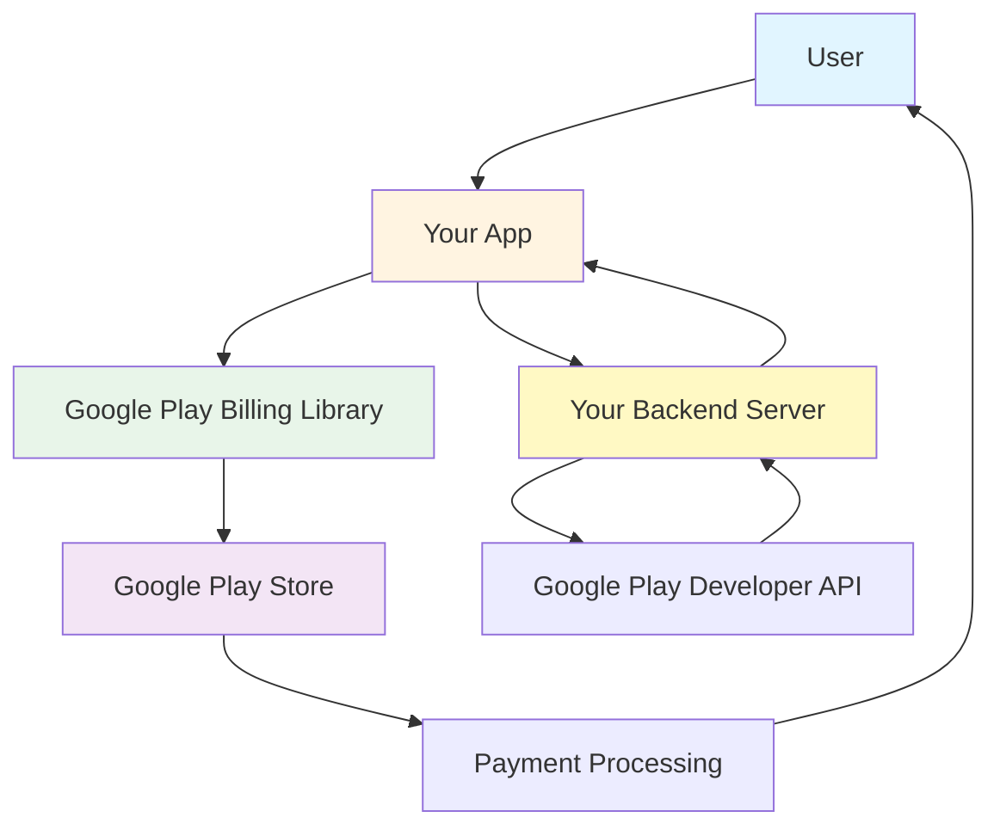
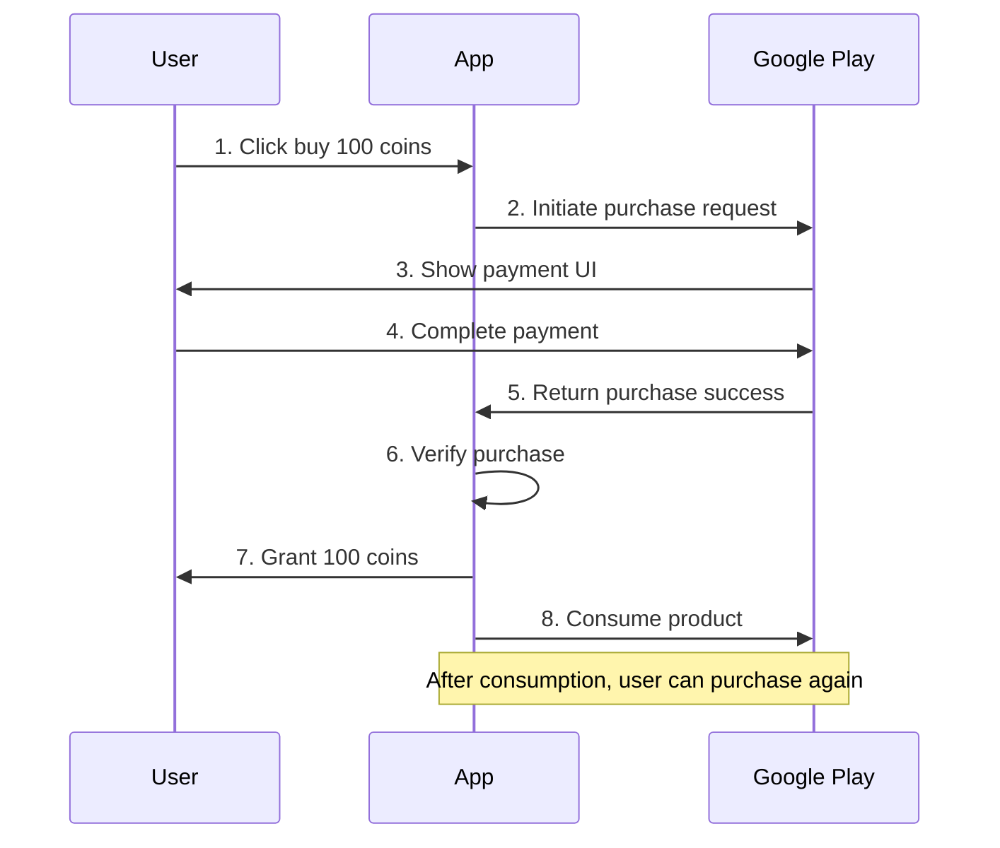
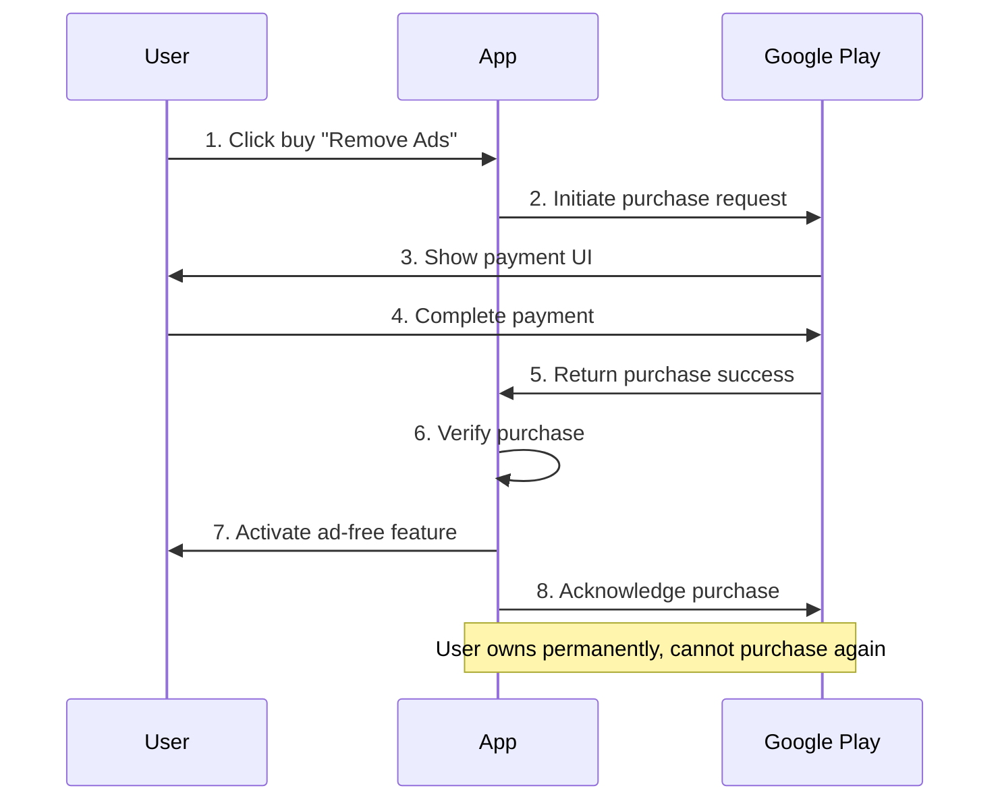
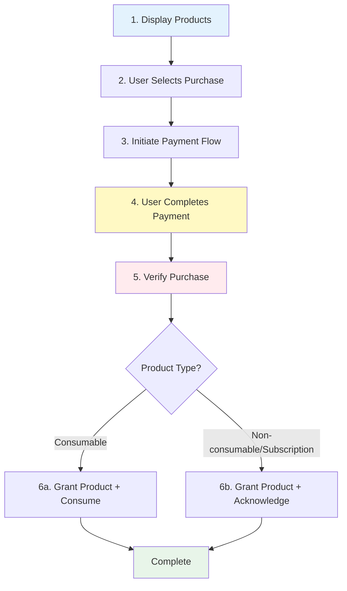
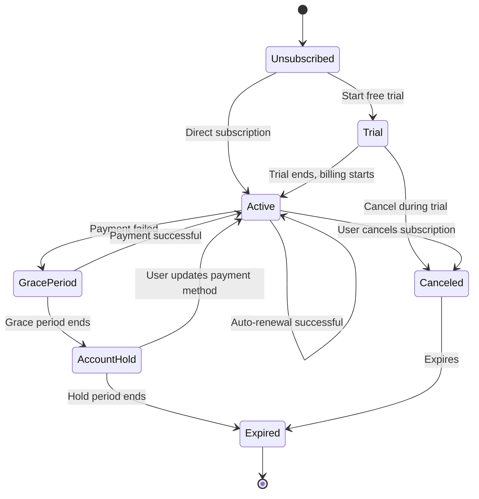
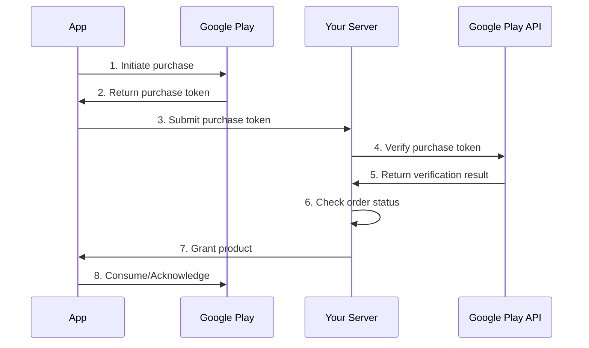

# Google Play Billing System Beginner's Guide

> This document is designed for developers who are completely new to Google Play payments. It primarily introduces conceptual knowledge to help you quickly understand the core concepts and working principles of the Google Play Billing system.

## Table of Contents

- [1. What is Google Play Billing System](#1-what-is-google-play-billing-system)
- [2. Core Concepts](#2-core-concepts)
- [3. Product Types](#3-product-types)
- [4. Purchase Flow](#4-purchase-flow)
- [5. Subscription System](#5-subscription-system)
- [6. Important Terminology](#6-important-terminology)
- [7. Security and Verification](#7-security-and-verification)

---

## 1. What is Google Play Billing System

### 1.1 Introduction

**Google Play Billing** is a service provided by Google that allows developers to sell digital products and content within Android applications.

Simply put:

- 📱 Users purchase virtual products in your app
- 💳 Complete payment through Google Play
- ✅ Google handles the payment process and takes a commission
- 🎁 Your app provides products or services to users

### 1.2 Why Use Google Play Billing System

**Advantages:**

1. **Secure and Reliable** - Google handles all payment details, compliant with PCI security standards
2. **Global Coverage** - Supports 130+ countries and regions, multiple payment methods
3. **User Trust** - Users are familiar with Google Play's payment process
4. **Automated** - Subscriptions auto-renew, refunds handled automatically
5. **Unified Management** - Manage products and orders in Google Play Console

**Use Cases:**

- In-game purchases (coins, items, skins, etc.)
- In-app membership subscriptions (VIP, premium features)
- Digital content (e-books, music, videos)
- Ad removal services
- Cloud storage space

### 1.3 System Architecture



**Main Components:**

1. **Your App** - Displays products, initiates purchase requests
2. **Google Play Billing Library** - SDK integrated in app, handles payment flow
3. **Google Play Store** - Processes actual payment transactions
4. **Your Backend Server** - Verifies purchases, grants products (highly recommended)
5. **Google Play Developer API** - Server-side interface for verification and order management

---

## 2. Core Concepts

### 2.1 Product

A **Product** is the digital content or service you sell in your app. Each product has:

- **Product ID**: Unique identifier, e.g., `com.example.coin_100`
- **Name**: Product name visible to users, e.g., "100 Coins"
- **Description**: Detailed product description
- **Price**: Pricing for different countries/regions

### 2.2 Purchase Token

A **Purchase Token** is a string representing user ownership of a product.

- Generated uniquely for each purchase
- Used to verify if user actually purchased the product
- Must be used for server-side verification

**Analogy:** Like a movie ticket - you need the ticket to enter. The purchase token is the user's "proof of purchase."

### 2.3 Order ID

An **Order ID** is a transaction number generated by Google Play.

- Generated for each payment
- Used for financial reconciliation and refund management
- Displayed in user's purchase receipt

**Analogy:** Like an online shopping order number, used to track and manage transactions.

### 2.4 Entitlement

**Entitlement** represents the user's right to use a product or service.

- **One-time Products**: Permanent entitlement after purchase
- **Subscriptions**: Entitlement during subscription period, expires after

---

## 3. Product Types

Google Play supports two main product categories: **One-time Products** and **Subscriptions**.

### 3.1 One-time Products

One-time products are items users purchase once and own, divided into two types:

#### 3.1.1 Consumable Products

**Characteristics:**

- ✅ Can be purchased repeatedly
- ✅ "Consumed" after use
- ✅ Can be purchased again after consumption

**Typical Examples:**

- Game coins, diamonds
- Game items (health potions, revival cards)
- In-app currency
- One-time power-ups

**Purchase Flow:**



**Important Concept - Consume:**

Consumable products must be "consumed" after purchase, otherwise users cannot purchase again.

- **Unconsumed**: User purchased but not consumed, cannot purchase again
- **Consumed**: Product used, user can purchase again

**Analogy:** Like buying a drink - you can only buy another after drinking (consuming) it.

#### 3.1.2 Non-consumable Products

**Characteristics:**

- ✅ Can only be purchased once
- ✅ Permanent ownership
- ❌ No consumption needed
- ❌ Cannot be purchased repeatedly

**Typical Examples:**

- Game level unlocks
- App premium version upgrade
- Ad removal feature
- Permanent feature unlocks

**Purchase Flow:**



**Important Concept - Acknowledge:**

Non-consumable products must be "acknowledged" after purchase to tell Google Play the product was successfully delivered.

- If not acknowledged within 3 days, Google will automatically refund
- After acknowledgment, purchase is complete

### 3.2 Subscription Products

**Subscription Products** are items that auto-renew on a periodic basis (e.g., monthly, yearly).

**Characteristics:**

- 🔄 Auto-renews until user cancels
- ⏰ Charged on fixed schedule
- ✅ Requires acknowledgment
- 📊 Has multiple states (active, canceled, grace period, etc.)

**Typical Examples:**

- VIP membership
- Music/video subscriptions
- News subscriptions
- Cloud storage space
- Premium feature subscriptions

**Subscription Periods:**

- Weekly
- Monthly
- Quarterly (3 months)
- Semi-annually (6 months)
- Yearly

---

## 4. Purchase Flow

### 4.1 Complete Purchase Flow

Whether one-time products or subscriptions, the purchase flow includes these key steps:



### 4.2 Step Details

#### Step 1: Display Products

App queries and displays available products list, including:

- Product name
- Product description
- Price (automatically localized)

#### Step 2: User Selects Purchase

User clicks purchase button, app prepares to initiate purchase request.

#### Step 3: Initiate Payment Flow

App calls Google Play Billing library, launches payment UI.

**What happens:**

- Google Play takes over the interface
- Shows product details and price
- Shows payment method selection

#### Step 4: User Completes Payment

User in Google Play interface:

- Confirms purchase
- Selects payment method
- Completes payment

**Payment methods may include:**

- Credit/debit cards
- Google Play balance
- Carrier billing
- PayPal
- Other local payment methods

#### Step 5: Verify Purchase

**Very Important!** App (preferably backend server) must verify purchase authenticity.

**Why verify?**

- Prevent fraud
- Ensure purchase is legitimate
- Avoid being tricked by cracked apps

**How to verify?**

- Use Google Play Developer API
- Verify purchase token validity
- Check order status

#### Step 6: Grant Product and Process

**Consumable Products:**

1. Grant product to user (e.g., add coins)
2. Call "consume" interface
3. User can purchase again

**Non-consumable Products/Subscriptions:**

1. Grant product to user (e.g., activate VIP)
2. Call "acknowledge" interface
3. Purchase complete

### 4.3 Purchase States

Purchases can be in different states:

| State | Description | App Action |
|------|------|----------|
| **Pending** | Payment not yet complete (e.g., waiting for bank confirmation) | Wait, don't grant product |
| **Purchased** | Payment successful, but not acknowledged/consumed | Grant product after verification |
| **Acknowledged** | Non-consumable product acknowledged | No action needed |
| **Consumed** | Consumable product consumed | Can purchase again |

---

## 5. Subscription System

Subscriptions are a more complex part of the Google Play Billing system, requiring understanding of more concepts.

### 5.1 Subscription Configuration

A subscription product can have multiple configurations:

#### Base Plan

**Base Plan** defines the basic attributes of a subscription:

- Billing period (monthly, yearly, etc.)
- Price
- Renewal type (auto-renewing or prepaid)

**One subscription can have multiple base plans**, for example:

- Monthly subscription: $9.99/month
- Annual subscription: $99.99/year (equivalent to $8.33/month)

#### Offer

**Offers** are promotional activities on top of base plans:

**Offer Types:**

1. **Free Trial** - Users use for free for a period
   - Example: 7-day free trial, then $9.99/month

2. **Introductory Price** - Discounted price for first-time subscribers
   - Example: $0.99 first month, then $9.99/month

3. **Promotional Price** - Limited-time offer
   - Example: $4.99/month for first 3 months, then $9.99/month

**Offer Example:**

```mermaid
gantt
    title Subscription Offer Example
    dateFormat X
    axisFormat %s
    
    section Free Trial
    7-day free trial :0, 7
    Regular price $9.99/month :7, 37
    
    section Introductory Price
    First month $0.99 :0, 30
    Regular price $9.99/month :30, 60
```



### 5.2 Subscription Lifecycle

Subscriptions go through various states during their lifecycle:



#### State Descriptions

| State | Description | User Access | Auto-renewal |
|------|------|----------|----------|
| **Active** | Subscription active, user paid | ✅ Can use | ✅ Will renew |
| **Trial** | Free trial phase | ✅ Can use | ✅ Will renew |
| **Canceled** | User canceled, but not expired | ✅ Can use | ❌ Won't renew |
| **Grace Period** | Payment failed, Google retrying | ✅ Can use | ⏳ Attempting renewal |
| **Account Hold** | Payment failed, waiting for user update | ❌ Cannot use | ⏳ Waiting for recovery |
| **Paused** | User paused subscription | ❌ Cannot use | ⏸️ Paused |
| **Expired** | Subscription ended | ❌ Cannot use | ❌ Ended |

#### Important State Details

**1. Grace Period**

When user's payment method has issues (e.g., expired credit card), Google Play will:

- Continue letting user access subscription content
- Retry billing in background
- Give user time to update payment method

**Grace period typically 3-7 days**

**2. Account Hold**

If grace period ends without successful payment:

- Suspend user's subscription access
- Retain user's subscription data
- Continue attempting to bill

**Hold period typically 30 days**

**3. Canceled vs Expired**

- **Canceled**: User actively canceled, but current period not ended, still can use
- **Expired**: Subscription period ended, cannot use anymore

### 5.3 Subscription Management

#### Upgrade and Downgrade

Users can change subscription plans during subscription period:

**Upgrade Example:**

- From "Monthly Member" to "Annual Member"
- From "Basic" to "Premium"

**Downgrade Example:**

- From "Annual Member" to "Monthly Member"
- From "Premium" to "Basic"

**Processing:**

| Action | Effective Time | Fee Processing |
|------|----------|----------|
| **Upgrade** | Immediate | Prorated refund for old subscription, charge for new subscription |
| **Downgrade** | After current period ends | No refund, next period charged at new price |

#### Cancel Subscription

Users can cancel subscription anytime:

1. User cancels subscription in Google Play
2. Subscription state changes to "Canceled"
3. Before current period ends, user can still use
4. After period ends, subscription expires

**Important:** App cannot cancel subscription on behalf of user, can only guide user to Google Play management page.

---

## 6. Important Terminology

### 6.1 Technical Terms

| Term | English | Description |
|------|------|------|
| **Google Play Billing Library** | Play Billing Library | SDK integrated in app, handles payment flow |
| **Google Play Console** | Play Console | Developer backend for managing apps and products |
| **Google Play Developer API** | - | Server-side API for verification and order management |
| **Real-time Developer Notifications** | Real-time Developer Notifications | Google-pushed subscription state change notifications |

### 6.2 Business Terms

| Term | English | Description |
|------|------|------|
| **Product ID** | Product ID | Unique identifier for product |
| **Purchase Token** | Purchase Token | Credential representing user's purchase right |
| **Order ID** | Order ID | Unique number for financial transaction |
| **Entitlement** | Entitlement | User's right to use product |
| **Consume** | Consume | Operation after consumable product is used |
| **Acknowledge** | Acknowledge | Confirmation after non-consumable product/subscription is delivered |

### 6.3 Subscription Terms

| Term | English | Description |
|------|------|------|
| **Base Plan** | Base Plan | Basic subscription configuration (period, price) |
| **Offer** | Offer | Promotional activity (trial, discount, etc.) |
| **Grace Period** | Grace Period | Grace time after payment failure |
| **Account Hold** | Account Hold | Data retention period after grace period |
| **Upgrade** | Upgrade | Switch to higher-tier subscription |
| **Downgrade** | Downgrade | Switch to lower-tier subscription |

---

## 7. Security and Verification

### 7.1 Why Verification is Needed

**Risks:**

- Hackers may crack app, forge purchases
- Users may use modified apps to cheat products
- Malicious users may reuse purchase credentials

**Solution:** Verify all purchases on server-side

### 7.2 Verification Flow



### 7.3 Verification Points

**Must verify:**

- ✅ Purchase token is valid
- ✅ Purchase state is "Purchased"
- ✅ Product ID matches
- ✅ Order hasn't been processed before (prevent duplicate grants)

**Server-side verification advantages:**

- 🔒 More secure, client cannot bypass
- 📊 Easy to record and audit
- 🔄 Supports cross-platform (iOS, Web, etc.)
- 💾 Unified data management

### 7.4 Prevent Duplicate Grants

**Problem:** Same purchase may be submitted multiple times

**Solution:** Use Order ID or Purchase Token for idempotency check

```
Pseudocode example:

function handlePurchase(purchaseToken) {
    // 1. Check if already processed
    if (database.exists(purchaseToken)) {
        return "Already processed"
    }
    
    // 2. Verify purchase
    if (!verifyWithGoogle(purchaseToken)) {
        return "Verification failed"
    }
    
    // 3. Grant product
    grantProduct(user, product)
    
    // 4. Record as processed
    database.save(purchaseToken)
    
    return "Success"
}
```

---

## 8. Best Practices

### 8.1 Development Recommendations

1. **Always verify on server-side** - Don't rely solely on client verification
2. **Handle all states** - Including pending, failed, canceled states
3. **Implement idempotency** - Prevent duplicate product grants
4. **Listen for real-time notifications** - Handle subscription state changes promptly
5. **Provide clear UI** - Let users understand purchase content and price
6. **Test all scenarios** - Including network errors, payment failures, etc.

### 8.2 User Experience

1. **Clear product descriptions** - Let users know what they're buying
2. **Localized pricing** - Google Play handles currency conversion automatically
3. **Subscription management** - Provide subscription status query and management entry
4. **Restore purchases** - Allow users to restore previous purchases
5. **Friendly error messages** - Give clear prompts when payment fails

### 8.3 Compliance Requirements

1. **Follow Google Play policies** - Don't sell prohibited products
2. **Clear subscription terms** - Inform users of renewal rules
3. **Provide refund support** - Handle refunds per Google Play policy
4. **Protect user privacy** - Handle purchase data properly

---

## 9. FAQ

### Q1: What's the difference between consume and acknowledge?

**A:**

- **Consume**: For consumable products, can be purchased again after consumption
- **Acknowledge**: For non-consumable products and subscriptions, confirms product delivery

### Q2: Why must acknowledge within 3 days?

**A:** Google's policy states automatic refund if not acknowledged within 3 days. This protects consumer rights.

### Q3: Which is better - subscriptions or one-time purchases?

**A:** Depends on your business model:

- **Subscriptions**: Suitable for ongoing services (membership, content subscriptions)
- **One-time purchases**: Suitable for one-time products (game items, feature unlocks)

### Q4: How to test purchase flow?

**A:**

1. Add test accounts in Google Play Console
2. Log in to device with test account
3. Test purchases won't charge real money
4. Test subscriptions accelerate expiration (e.g., monthly becomes 5 minutes)

### Q5: How to restore purchases after changing devices?

**A:**

- **Non-consumable products and subscriptions**: Auto-restore, just query purchase records
- **Consumable products**: Cannot restore (because consumed)

### Q6: How to handle refunds?

**A:**

- User requests refund in Google Play
- Google processes refund request
- You receive real-time notification
- App should revoke user's entitlement

---

## 10. Next Steps

Now that you understand the basic concepts of Google Play Billing system, you can:

1. 📖 Read technical integration documentation to learn implementation
2. 🎮 Check sample code to learn best practices
3. 🧪 Create test products for actual testing
4. 🚀 Publish your first paid product

**Related Resources:**

- [Google Play Billing Official Documentation](https://developer.android.com/google/play/billing)
- [Google Play Console](https://play.google.com/console)
- [Google Play Developer API](https://developers.google.com/android-publisher/)

---

## Summary

Google Play Billing system is a powerful and comprehensive payment solution:

- 🛡️ **Secure and Reliable** - Google-level security assurance
- 🌍 **Global Coverage** - Supports global users and multiple payment methods
- 🔄 **Automated** - Subscriptions auto-renew, reducing management costs
- 💰 **Flexible Pricing** - Supports various product types and promotional strategies

After understanding these core concepts, you can start integrating Google Play Billing system in your app to provide users with quality paid experiences!
