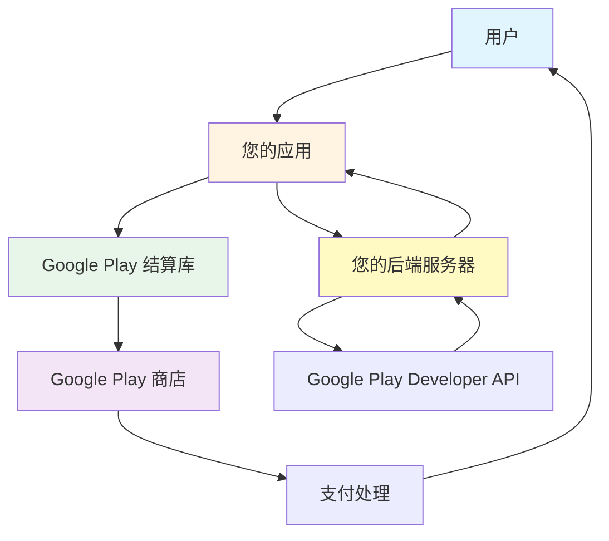
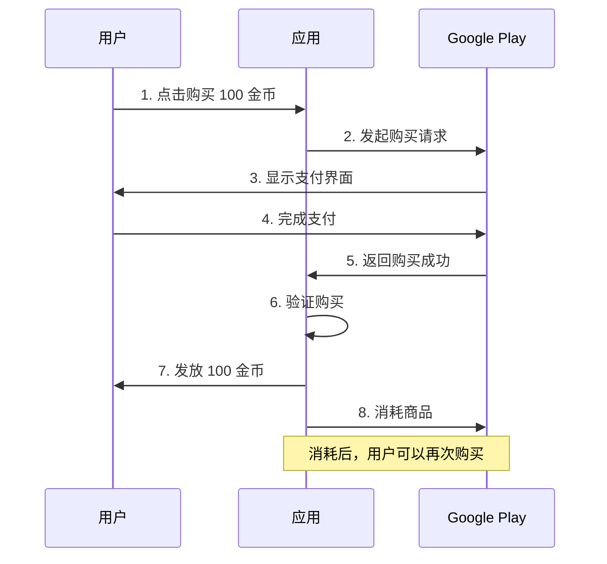
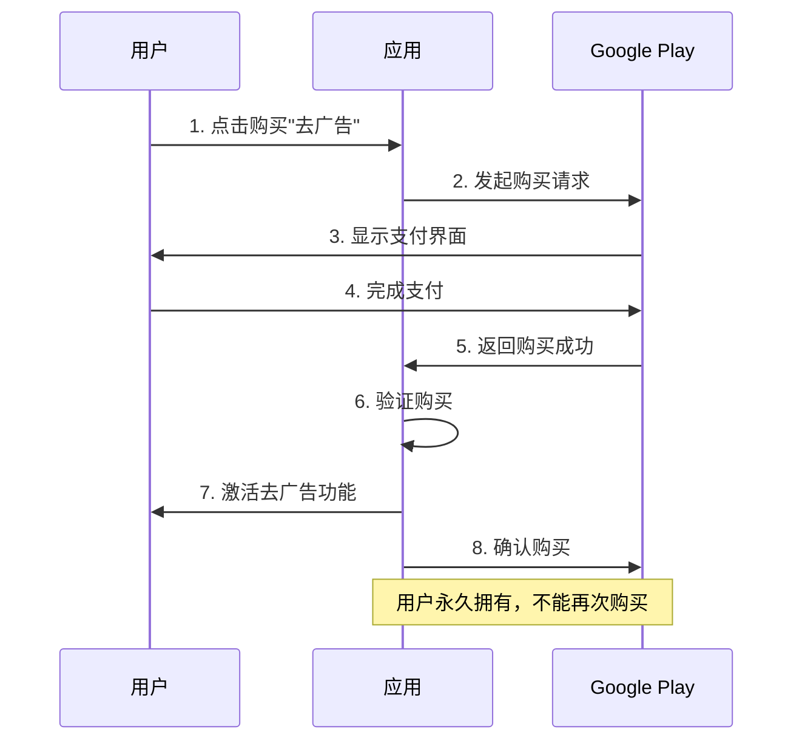
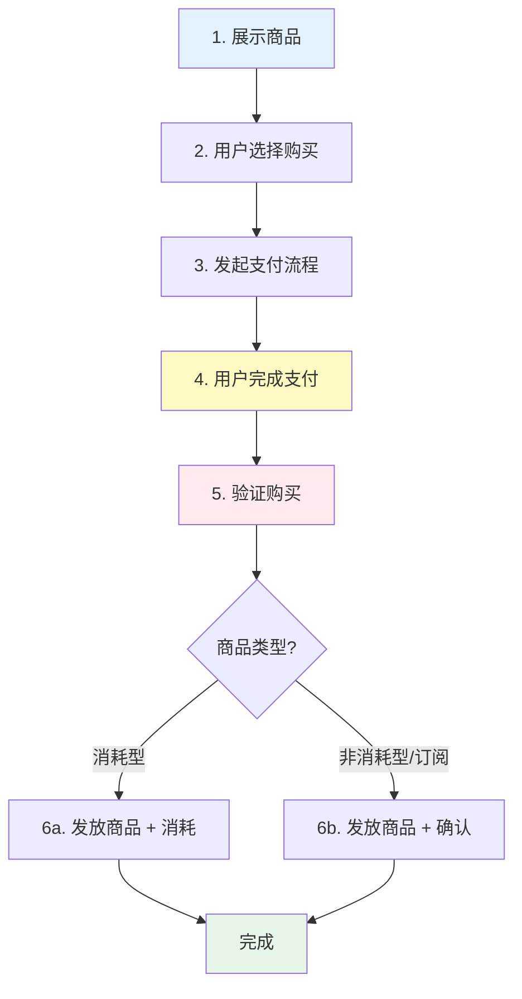
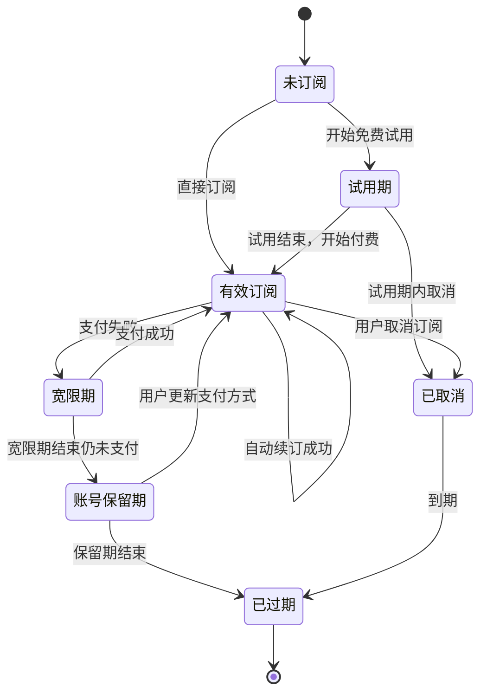
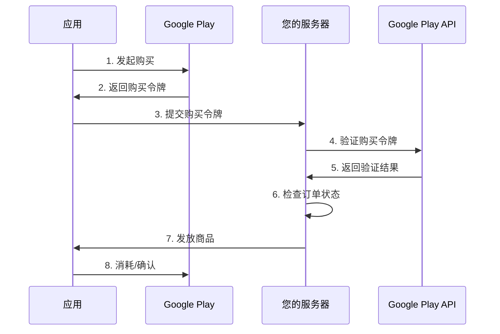

# Google Play 结算系统入门指南

> 本文档面向完全不了解 Google Play 支付的开发者，主要介绍概念性知识，帮助您快速理解 Google Play 结算系统的核心概念和工作原理。

## 目录

- [1. 什么是 Google Play 结算系统](#1-什么是-google-play-结算系统)
- [2. 核心概念](#2-核心概念)
- [3. 商品类型](#3-商品类型)
- [4. 购买流程](#4-购买流程)
- [5. 订阅系统](#5-订阅系统)
- [6. 重要术语](#6-重要术语)
- [7. 安全与验证](#7-安全与验证)

---

## 1. 什么是 Google Play 结算系统

### 1.1 简介

**Google Play 结算系统**（Google Play Billing）是 Google 提供的一项服务，允许开发者在 Android 应用中销售数字商品和内容。

简单来说，就是：

- 📱 用户在您的应用中购买虚拟商品
- 💳 通过 Google Play 完成支付
- ✅ Google 处理支付流程并分成
- 🎁 您的应用向用户提供商品或服务

### 1.2 为什么使用 Google Play 结算系统

**优势：**

1. **安全可靠** - Google 处理所有支付细节，符合 PCI 安全标准
2. **全球覆盖** - 支持 130+ 个国家和地区，多种支付方式
3. **用户信任** - 用户熟悉 Google Play 的支付流程
4. **自动化** - 订阅自动续费，退款自动处理
5. **统一管理** - 在 Google Play 管理中心统一管理商品和订单

**适用场景：**

- 游戏内购买（金币、道具、皮肤等）
- 应用内会员订阅（VIP、高级功能）
- 数字内容（电子书、音乐、视频）
- 去广告服务
- 云存储空间

### 1.3 系统架构



**主要组成部分：**

1. **您的应用** - 展示商品，发起购买请求
2. **Google Play 结算库** - 应用中集成的 SDK，处理支付流程
3. **Google Play 商店** - 处理实际的支付交易
4. **您的后端服务器** - 验证购买，发放商品（强烈推荐）
5. **Google Play Developer API** - 服务器端验证和管理订单的接口

---

## 2. 核心概念

### 2.1 商品（Product）

**商品**是您在应用中销售的数字内容或服务。每个商品都有：

- **商品 ID**（Product ID）：唯一标识符，如 `com.example.coin_100`
- **名称**：用户看到的商品名称，如 "100 金币"
- **描述**：商品的详细说明
- **价格**：各个国家/地区的定价

### 2.2 购买令牌（Purchase Token）

**购买令牌**是一个字符串，代表用户对某个商品的所有权。

- 每次购买都会生成一个唯一的购买令牌
- 用于验证用户是否真的购买了商品
- 服务器端验证时必须使用购买令牌

**类比：** 就像电影票，凭票入场。购买令牌就是用户的"购买凭证"。

### 2.3 订单 ID（Order ID）

**订单 ID** 是 Google Play 生成的交易编号。

- 每次支付都会生成一个订单 ID
- 用于财务对账和退款管理
- 用户的购买收据中会显示订单 ID

**类比：** 就像网购的订单号，用于追踪和管理交易。

### 2.4 使用权（Entitlement）

**使用权**表示用户有权使用某个商品或服务。

- **一次性商品**：购买后永久拥有使用权
- **订阅商品**：订阅期内拥有使用权，到期后失效

---

## 3. 商品类型

Google Play 支持两大类商品：**一次性商品**和**订阅商品**。

### 3.1 一次性商品（One-time Products）

一次性商品是用户购买一次就拥有的商品，又分为两种：

#### 3.1.1 消耗型商品（Consumable）

**特点：**

- ✅ 可以重复购买
- ✅ 使用后会"消耗"掉
- ✅ 消耗后可以再次购买

**典型例子：**

- 游戏金币、钻石
- 游戏道具（血瓶、复活卡）
- 应用内货币
- 一次性增益道具

**购买流程：**



**重要概念 - 消耗（Consume）：**

消耗型商品购买后必须"消耗"，否则用户无法再次购买。

- **未消耗**：用户已购买但未消耗，无法再次购买
- **已消耗**：商品已使用，用户可以再次购买

**类比：** 就像买饮料，喝完（消耗）后才能再买一瓶。

#### 3.1.2 非消耗型商品（Non-consumable）

**特点：**

- ✅ 只能购买一次
- ✅ 永久拥有
- ❌ 不需要消耗
- ❌ 不能重复购买

**典型例子：**

- 游戏关卡解锁
- 应用高级版升级
- 去广告功能
- 永久性功能解锁

**购买流程：**



**重要概念 - 确认（Acknowledge）：**

非消耗型商品购买后必须"确认"，告诉 Google Play 商品已成功交付。

- 如果 3 天内不确认，Google 会自动退款
- 确认后，购买才算完成

### 3.2 订阅商品（Subscriptions）

**订阅商品**是按周期（如每月、每年）自动续费的商品。

**特点：**

- 🔄 自动续订，直到用户取消
- ⏰ 按固定周期收费
- ✅ 需要确认购买
- 📊 有多种状态（有效、已取消、宽限期等）

**典型例子：**

- VIP 会员
- 音乐/视频订阅
- 新闻订阅
- 云存储空间
- 高级功能订阅

**订阅周期：**

- 每周
- 每月
- 每季度（3 个月）
- 每半年（6 个月）
- 每年

---

## 4. 购买流程

### 4.1 完整购买流程

无论是一次性商品还是订阅，购买流程都包含以下关键步骤：



### 4.2 步骤详解

#### 步骤 1: 展示商品

应用查询并展示可购买的商品列表，包括：

- 商品名称
- 商品描述
- 价格（自动本地化）

#### 步骤 2: 用户选择购买

用户点击购买按钮，应用准备发起购买请求。

#### 步骤 3: 发起支付流程

应用调用 Google Play 结算库，启动支付界面。

**此时会发生：**

- Google Play 接管界面
- 显示商品详情和价格
- 显示支付方式选择

#### 步骤 4: 用户完成支付

用户在 Google Play 界面中：

- 确认购买
- 选择支付方式
- 完成支付

**支付方式可能包括：**

- 信用卡/借记卡
- Google Play 余额
- 运营商代扣
- PayPal
- 其他本地支付方式

#### 步骤 5: 验证购买

**非常重要！** 应用（最好是后端服务器）必须验证购买的真实性。

**为什么要验证？**

- 防止欺诈
- 确保购买合法
- 避免被破解应用骗取商品

**如何验证？**

- 使用 Google Play Developer API
- 验证购买令牌的有效性
- 检查订单状态

#### 步骤 6: 发放商品并处理

**消耗型商品：**

1. 发放商品给用户（如增加金币）
2. 调用"消耗"接口
3. 用户可以再次购买

**非消耗型商品/订阅：**

1. 发放商品给用户（如激活 VIP）
2. 调用"确认"接口
3. 购买完成

### 4.3 购买状态

购买可能处于不同的状态：

| 状态 | 说明 | 应用操作 |
|------|------|----------|
| **待处理** | 支付尚未完成（如等待银行确认） | 等待，不发放商品 |
| **已购买** | 支付成功，但未确认/消耗 | 验证后发放商品 |
| **已确认** | 非消耗型商品已确认 | 无需操作 |
| **已消耗** | 消耗型商品已消耗 | 可以再次购买 |

---

## 5. 订阅系统

订阅是 Google Play 结算系统中较为复杂的部分，需要理解更多概念。

### 5.1 订阅配置

一个订阅商品可以有多种配置：

#### 基础方案（Base Plan）

**基础方案**定义了订阅的基本属性：

- 计费周期（每月、每年等）
- 价格
- 续订类型（自动续订或预付费）

**一个订阅可以有多个基础方案**，例如：

- 月度订阅：每月 $9.99
- 年度订阅：每年 $99.99（相当于每月 $8.33）

#### 优惠（Offer）

**优惠**是在基础方案上的促销活动：

**优惠类型：**

1. **免费试用** - 用户免费使用一段时间
   - 例如：7 天免费试用，然后每月 $9.99

2. **介绍价格** - 首次订阅享受优惠价
   - 例如：首月 $0.99，之后每月 $9.99

3. **促销价格** - 限时优惠
   - 例如：前 3 个月每月 $4.99，之后每月 $9.99

**优惠示例：**

```mermaid
gantt
    title 订阅优惠示例
    dateFormat X
    axisFormat %s
    
    section 免费试用
    免费试用 7 天 :0, 7
    正常价格 $9.99/月 :7, 37
    
    section 介绍价格
    首月 $0.99 :0, 30
    正常价格 $9.99/月 :30, 60
```



### 5.2 订阅生命周期

订阅在其生命周期中会经历多种状态：



#### 状态说明

| 状态 | 说明 | 用户权益 | 自动续订 |
|------|------|----------|----------|
| **有效订阅** | 订阅正常，用户已付费 | ✅ 可使用 | ✅ 会续订 |
| **试用期** | 免费试用阶段 | ✅ 可使用 | ✅ 会续订 |
| **已取消** | 用户已取消，但未到期 | ✅ 可使用 | ❌ 不续订 |
| **宽限期** | 支付失败，Google 重试中 | ✅ 可使用 | ⏳ 尝试续订 |
| **账号保留期** | 支付失败，等待用户更新 | ❌ 不可使用 | ⏳ 等待恢复 |
| **已暂停** | 用户主动暂停订阅 | ❌ 不可使用 | ⏸️ 已暂停 |
| **已过期** | 订阅已结束 | ❌ 不可使用 | ❌ 已结束 |

#### 重要状态详解

**1. 宽限期（Grace Period）**

当用户的支付方式出现问题时（如信用卡过期），Google Play 会：

- 继续让用户使用订阅内容
- 在后台尝试重新扣款
- 给用户时间更新支付方式

**宽限期通常为 3-7 天**

**2. 账号保留期（Account Hold）**

如果宽限期结束仍未支付成功：

- 暂停用户的订阅权益
- 保留用户的订阅数据
- 继续尝试扣款

**保留期通常为 30 天**

**3. 已取消 vs 已过期**

- **已取消**：用户主动取消，但当前周期未结束，仍可使用
- **已过期**：订阅周期已结束，不能再使用

### 5.3 订阅管理

#### 升级和降级

用户可以在订阅期间更改订阅计划：

**升级示例：**

- 从"月度会员"升级到"年度会员"
- 从"基础版"升级到"高级版"

**降级示例：**

- 从"年度会员"降级到"月度会员"
- 从"高级版"降级到"基础版"

**处理方式：**

| 操作 | 生效时间 | 费用处理 |
|------|----------|----------|
| **升级** | 立即生效 | 按比例退款旧订阅，收取新订阅费用 |
| **降级** | 当前周期结束后生效 | 不退款，下个周期按新价格收费 |

#### 取消订阅

用户可以随时取消订阅：

1. 用户在 Google Play 中取消订阅
2. 订阅状态变为"已取消"
3. 当前周期结束前，用户仍可使用
4. 周期结束后，订阅过期

**重要：** 应用无法代替用户取消订阅，只能引导用户到 Google Play 管理页面。

---

## 6. 重要术语

### 6.1 技术术语

| 术语 | 英文 | 说明 |
|------|------|------|
| **Google Play 结算库** | Play Billing Library | 集成到应用中的 SDK，处理支付流程 |
| **Google Play 管理中心** | Play Console | 开发者管理应用和商品的后台 |
| **Google Play Developer API** | - | 服务器端验证和管理订单的 API |
| **实时开发者通知** | Real-time Developer Notifications | Google 推送的订阅状态变化通知 |

### 6.2 业务术语

| 术语 | 英文 | 说明 |
|------|------|------|
| **商品 ID** | Product ID | 商品的唯一标识符 |
| **购买令牌** | Purchase Token | 代表用户购买权的凭证 |
| **订单 ID** | Order ID | 财务交易的唯一编号 |
| **使用权** | Entitlement | 用户使用商品的权利 |
| **消耗** | Consume | 消耗型商品使用后的操作 |
| **确认** | Acknowledge | 非消耗型商品/订阅交付后的确认 |

### 6.3 订阅术语

| 术语 | 英文 | 说明 |
|------|------|------|
| **基础方案** | Base Plan | 订阅的基本配置（周期、价格） |
| **优惠** | Offer | 促销活动（试用、折扣等） |
| **宽限期** | Grace Period | 支付失败后的宽限时间 |
| **账号保留期** | Account Hold | 宽限期后的数据保留期 |
| **升级** | Upgrade | 更换到更高级的订阅 |
| **降级** | Downgrade | 更换到更低级的订阅 |

---

## 7. 安全与验证

### 7.1 为什么需要验证

**风险：**

- 黑客可能破解应用，伪造购买
- 用户可能使用修改版应用骗取商品
- 恶意用户可能重复使用购买凭证

**解决方案：** 在服务器端验证所有购买

### 7.2 验证流程



### 7.3 验证要点

**必须验证：**

- ✅ 购买令牌是否有效
- ✅ 购买状态是否为"已购买"
- ✅ 商品 ID 是否匹配
- ✅ 订单是否已经处理过（防止重复发放）

**服务器端验证的优势：**

- 🔒 更安全，客户端无法绕过
- 📊 便于记录和审计
- 🔄 支持跨平台（iOS、Web 等）
- 💾 统一的数据管理

### 7.4 防止重复发放

**问题：** 同一个购买可能被多次提交

**解决方案：** 使用订单 ID 或购买令牌做幂等性检查

```
伪代码示例：

function handlePurchase(purchaseToken) {
    // 1. 检查是否已处理
    if (database.exists(purchaseToken)) {
        return "已处理过"
    }
    
    // 2. 验证购买
    if (!verifyWithGoogle(purchaseToken)) {
        return "验证失败"
    }
    
    // 3. 发放商品
    grantProduct(user, product)
    
    // 4. 记录已处理
    database.save(purchaseToken)
    
    return "成功"
}
```

---

## 8. 最佳实践

### 8.1 开发建议

1. **始终在服务器端验证** - 不要仅依赖客户端验证
2. **处理所有状态** - 包括待处理、失败、取消等状态
3. **实现幂等性** - 防止重复发放商品
4. **监听实时通知** - 及时处理订阅状态变化
5. **提供清晰的用户界面** - 让用户了解购买内容和价格
6. **测试所有场景** - 包括网络错误、支付失败等

### 8.2 用户体验

1. **清晰的商品描述** - 让用户知道买的是什么
2. **本地化价格** - Google Play 自动处理货币转换
3. **订阅管理** - 提供订阅状态查询和管理入口
4. **恢复购买** - 允许用户恢复之前的购买
5. **友好的错误提示** - 支付失败时给出明确的提示

### 8.3 合规要求

1. **遵守 Google Play 政策** - 不得销售违禁商品
2. **明确的订阅条款** - 告知用户续费规则
3. **提供退款支持** - 按 Google Play 政策处理退款
4. **保护用户隐私** - 妥善处理购买数据

---

## 9. 常见问题

### Q1: 消耗和确认有什么区别？

**A:**

- **消耗（Consume）**：用于消耗型商品，消耗后可以再次购买
- **确认（Acknowledge）**：用于非消耗型商品和订阅，确认商品已交付

### Q2: 为什么必须在 3 天内确认购买？

**A:** Google 的政策规定，如果 3 天内不确认，会自动退款给用户。这是为了保护消费者权益。

### Q3: 订阅和一次性购买哪个更好？

**A:** 取决于您的业务模式：

- **订阅**：适合持续提供服务（如会员、内容订阅）
- **一次性购买**：适合一次性商品（如游戏道具、功能解锁）

### Q4: 如何测试购买流程？

**A:**

1. 在 Google Play 管理中心添加测试账号
2. 使用测试账号登录设备
3. 测试购买不会真实扣费
4. 测试订阅会加速到期（如月订阅变为 5 分钟）

### Q5: 用户换设备后如何恢复购买？

**A:**

- **非消耗型商品和订阅**：自动恢复，只需查询购买记录
- **消耗型商品**：无法恢复（因为已消耗）

### Q6: 如何处理退款？

**A:**

- 用户在 Google Play 申请退款
- Google 处理退款请求
- 您会收到实时通知
- 应用应撤销用户的使用权

---

## 10. 下一步

现在您已经了解了 Google Play 结算系统的基本概念，可以：

1. 📖 阅读技术集成文档，了解如何在应用中实现
2. 🎮 查看示例代码，学习最佳实践
3. 🧪 创建测试商品，进行实际测试
4. 🚀 发布您的第一个付费商品

**相关资源：**

- [Google Play 结算官方文档](https://developer.android.com/google/play/billing?hl=zh-cn)
- [Google Play 管理中心](https://play.google.com/console?hl=zh-cn)
- [Google Play Developer API](https://developers.google.com/android-publisher/?hl=zh-cn)

---

## 总结

Google Play 结算系统是一个强大而完善的支付解决方案：

- 🛡️ **安全可靠** - Google 级别的安全保障
- 🌍 **全球覆盖** - 支持全球用户和多种支付方式
- 🔄 **自动化** - 订阅自动续费，减少管理成本
- 💰 **灵活定价** - 支持多种商品类型和优惠策略

理解这些核心概念后，您就可以开始在应用中集成 Google Play 结算系统，为用户提供优质的付费体验！
