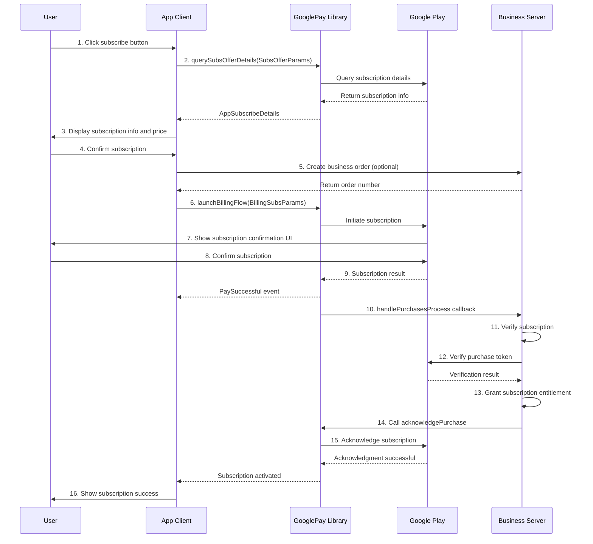
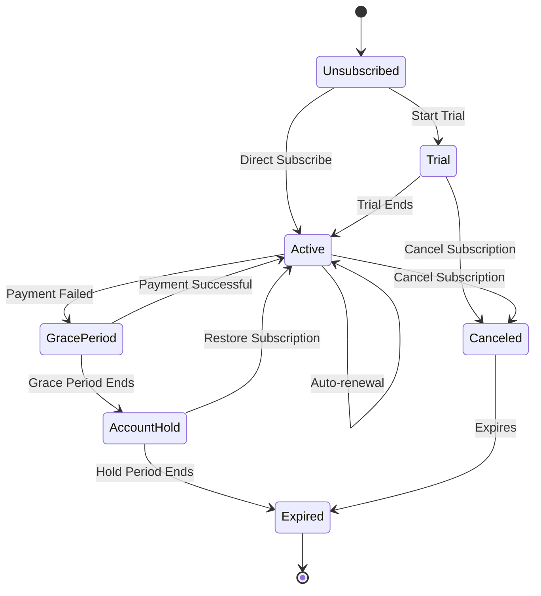

# GooglePay Subscription Purchase Flow

This document provides a detailed guide on implementing the complete purchase flow for subscription products using the GooglePay library.

## 1. Overview

### 1.1 What are Subscription Products

Subscription products are items that users pay for on a recurring basis (e.g., monthly, yearly) and auto-renew until canceled. Common subscription products include:

- VIP Membership
- Premium feature subscriptions
- Content subscriptions (Music, Video, News, etc.)
- Cloud storage space
- Ad-free services

### 1.2 Characteristics of Subscription Products

- **Auto-renewal**: Automatically renews upon expiration unless canceled by the user
- **Recurring**: Charged on a fixed cycle (weekly, monthly, quarterly, yearly, etc.)
- **Requires Acknowledgment**: Must call `acknowledgePurchase` after successful purchase
- **Supports Offers**: Can set up free trials, introductory prices, etc.
- **State Management**: Need to manage subscription validity, pause, resume, etc.

### 1.3 Subscription Modes

The GooglePay library supports two subscription modes:

| Mode | Description | Use Case |
|------|------|----------|
| **SingleMode** | Single subscription mode, user can only have one active subscription at a time | Membership tier systems (Standard, VIP, SVIP) |
| **MultiModal** | Multi-subscription mode, user can have multiple active subscriptions simultaneously | Independent feature subscriptions |

## 2. Prerequisites

### 2.1 Google Play Console Configuration

#### Create Subscription Product

1. Log in to [Google Play Console](https://play.google.com/console)
2. Select your app
3. Navigate to **Subscriptions** → **Create subscription**
4. Fill in basic subscription info:
   - **Subscription ID**: Unique identifier (e.g., `monthly_vip`)
   - **Name**: Subscription display name
   - **Description**: Subscription description

#### Configure Base Plan

Every subscription needs at least one Base Plan:

1. Click **Add base plan**
2. Set **Base Plan ID** (e.g., `monthly-plan`)
3. Select **Renewal type**: Auto-renewing
4. Set **Billing period**: Monthly, Yearly, etc.
5. Set **Price**: Prices for different countries/regions

#### Configure Offer (Optional)

You can add offers to a Base Plan:

1. In Base Plan, click **Add offer**
2. Set **Offer ID** (e.g., `trial-7days`)
3. Select offer type:
   - **Free trial**: Free usage for a period
   - **Introductory price**: Discounted price for first-time subscribers
   - **Promotional price**: Limited-time offer
4. Set offer details and price

### 2.2 Application Initialization Configuration

Initialize GooglePayClient in your `Application` class:

```kotlin
class App : Application(), GooglePayService {
    
    override fun onCreate() {
        super.onCreate()
        
        GooglePayClient.getInstance()
            .initBillingClient(this, this)
            .setDebug(true)  // Enable debug logging in development
            .setSubscription(true)  // Enable subscription support
            .setSubscriptionMode(SubscriptionMode.SingleMode)  // Single subscription mode
            .setInterval(15)  // Auto-refresh interval 15 seconds
            .registerActivitys(listOf(MainActivity::class.java))
    }
    
    // Implement GooglePayService interface
    override fun getOneTimeConsumableProducts(): List<String> {
        return emptyList()  // No consumable products
    }
    
    override fun getOneTimeNonConsumableProducts(): List<String> {
        return emptyList()
    }
    
    override fun getSubscribeProducts(): List<String> {
        return listOf(
            "monthly_vip",
            "yearly_vip"
        )
    }
    
    override fun handlePurchasesProcess(
        isPay: Boolean,
        productType: BillingProductType,
        purchases: Purchase
    ) {
        // Handle subscription verification logic (see following sections)
    }
}
```

## 3. Complete Purchase Flow

### Flow Diagram



### Step 1: Query Subscription Details

Before displaying the subscription list, query detailed subscription information (price, offers, etc.).

```kotlin
class SubscriptionViewModel : ViewModel() {
    
    private val subscriptionService = GooglePayClient.getInstance()
        .getPayService<SubscriptionService>()
    
    private val _subscriptions = MutableLiveData<List<SubscriptionData>>()
    val subscriptions: LiveData<List<SubscriptionData>> = _subscriptions
    
    fun loadSubscriptions() {
        viewModelScope.launch {
            // 1. Build query parameters
            val params = SubsOfferParams.Builder()
                .setProductIds(listOf("monthly_vip", "yearly_vip"))
                .build()
            
            // 2. Query subscription details
            subscriptionService.querySubsOfferDetails(params).collect { result ->
                result.onSuccess { subscriptionList ->
                    // 3. Process subscription data
                    val data = subscriptionList.map { subscription ->
                        SubscriptionData(
                            productId = subscription.productId,
                            productName = subscription.productName,
                            basePlanId = extractBasePlanId(subscription),
                            offerId = extractOfferId(subscription),
                            pricingPhases = subscription.pricingPhases
                        )
                    }
                    _subscriptions.value = data
                    Log.d("Subs", "Loaded successfully: ${data.size} subscriptions")
                }
                result.onFailure { error ->
                    Log.e("Subs", "Load failed: ${error.message}")
                }
            }
        }
    }
    
    private fun extractBasePlanId(subscription: AppSubscribeDetails): String {
        // Extract basePlanId from subscription details
        // Implementation depends on specific library API
        return "monthly-plan"
    }
    
    private fun extractOfferId(subscription: AppSubscribeDetails): String? {
        // Extract offerId from subscription details (if any)
        return null
    }
}

data class SubscriptionData(
    val productId: String,
    val productName: String,
    val basePlanId: String,
    val offerId: String?,
    val pricingPhases: List<PricingPhase>
)
```

**AppSubscribeDetails Field Description:**

| Field | Type | Description |
|------|------|------|
| `productId` | String | Subscription Product ID |
| `productName` | String | Subscription Product Name |
| `pricingPhases` | List&lt;PricingPhase&gt; | Pricing phases list |

**PricingPhase Field Description:**

| Field | Type | Description |
|------|------|------|
| `formattedPrice` | String | Formatted price (e.g., "€7.99") |
| `priceAmountMicros` | Long | Price in micros |
| `priceCurrencyCode` | String | Currency code (e.g., "EUR") |

### Step 2: Initiate Subscription Purchase

After the user clicks the subscribe button, build subscription parameters and initiate the subscription flow.

```kotlin
class SubsFragment : Fragment() {
    
    private val subscriptionService = GooglePayClient.getInstance()
        .getPayService<SubscriptionService>()
    
    private fun onSubscriptionClick(subscription: SubscriptionData) {
        lifecycleScope.launch {
            try {
                // 1. Optional: Create order on business server
                val chargeNo = createBusinessOrder(subscription.productId)
                
                // 2. Build subscription parameters
                val params = BillingSubsParams.Builder()
                    .setAccountId("user_12345")  // User unique identifier
                    .setProductId(subscription.productId)  // Subscription Product ID
                    .setChargeNo(chargeNo)  // Business order number (optional)
                    .setBasePlanId(subscription.basePlanId)  // Base Plan ID
                    .setOfferId(subscription.offerId)  // Offer ID (if any)
                    .build()
                
                // 3. Initiate subscription
                val result = subscriptionService.launchBillingFlow(
                    requireActivity(),
                    params
                )
                
                // 4. Handle return result
                when (result.code) {
                    AppBillingResponseCode.OK -> {
                        Log.d("Subs", "Subscription flow initiated")
                    }
                    AppBillingResponseCode.USER_CANCELED -> {
                        showToast("You canceled the subscription")
                    }
                    AppBillingResponseCode.ITEM_ALREADY_OWNED -> {
                        showToast("You are already subscribed to this item")
                        // Can query current subscription status
                        queryCurrentSubscription()
                    }
                    else -> {
                        showToast("Subscription failed: ${result.message}")
                    }
                }
                
            } catch (e: Exception) {
                showToast("Subscription failed: ${e.message}")
            }
        }
    }
    
    private suspend fun createBusinessOrder(productId: String): String {
        return withContext(Dispatchers.IO) {
            // Call business server API to create order
            "SUB_ORDER_${System.currentTimeMillis()}"
        }
    }
}
```

**BillingSubsParams Parameter Description:**

| Parameter | Type | Required | Description |
|------|------|------|------|
| `accountId` | String | Yes | User unique identifier |
| `productId` | String | Yes | Subscription Product ID |
| `chargeNo` | String | No | Business order number |
| `basePlanId` | String | Yes | Base Plan ID |
| `offerId` | String | No | Offer ID (Required if offer exists) |

### Step 3: Listen for Payment Events

Use `observePayEvent` to listen for subscription results.

```kotlin
class SubsFragment : Fragment() {
    
    override fun onViewCreated(view: View, savedInstanceState: Bundle?) {
        super.onViewCreated(view, savedInstanceState)
        
        // Listen for payment events
        observePayEvent { event ->
            when (event) {
                is BillingPayEvent.PaySuccessful -> {
                    // Subscription successful
                    Log.d("Subs", "Subscription successful: ${event.purchase.orderId}")
                    showLoading("Activating subscription...")
                    
                    // Note: Subscription products do not trigger PayConsumeSuccessful
                    // Must manually acknowledge after server verification
                }
                
                is BillingPayEvent.PayFailed -> {
                    // Subscription failed
                    hideLoading()
                    showToast("Subscription failed: ${event.message}")
                    Log.e("Subs", "Subscription failed: code=${event.code}, msg=${event.message}")
                }
                
                is BillingPayEvent.PayConsumeSuccessful -> {
                    // Subscription products do not trigger this event
                }
                
                is BillingPayEvent.PayConsumeFailed -> {
                    // Subscription products do not trigger this event
                }
            }
        }
    }
}
```

### Step 4: Server Verification and Acknowledgment

Implement subscription verification and acknowledgment logic in `GooglePayService.handlePurchasesProcess()`.

```kotlin
class App : Application(), GooglePayService {
    
    override fun handlePurchasesProcess(
        isPay: Boolean,
        productType: BillingProductType,
        purchases: Purchase
    ) {
        // Check if it is a subscription product
        if (productType != BillingProductType.SUBS) return
        
        // Process in background thread
        CoroutineScope(Dispatchers.IO).launch {
            try {
                // 1. Extract order information
                val productId = purchases.products.firstOrNull() ?: return@launch
                val purchaseToken = purchases.purchaseToken
                val orderId = purchases.orderId
                val accountId = purchases.accountIdentifiers?.obfuscatedAccountId
                
                Log.d("Subscription", "Processing subscription: orderId=$orderId, productId=$productId")
                
                // 2. Check if already acknowledged
                if (purchases.isAcknowledged) {
                    Log.d("Subscription", "Subscription already acknowledged, skipping")
                    return@launch
                }
                
                // 3. Call business server to verify subscription
                val verifyResult = verifySubscriptionOnServer(
                    productId = productId,
                    purchaseToken = purchaseToken,
                    orderId = orderId,
                    accountId = accountId
                )
                
                if (verifyResult.success) {
                    // 4. Verification successful, grant subscription entitlement
                    Log.d("Subscription", "Subscription verified successfully, acknowledging...")
                    
                    // 5. Acknowledge subscription (Important!)
                    acknowledgePurchase(purchases)
                    
                } else {
                    Log.e("Subscription", "Subscription verification failed: ${verifyResult.message}")
                }
                
            } catch (e: Exception) {
                Log.e("Subscription", "Exception processing subscription", e)
            }
        }
    }
    
    private suspend fun acknowledgePurchase(purchase: Purchase) {
        withContext(Dispatchers.IO) {
            try {
                // Call Google Play Billing API to acknowledge subscription
                val billingClient = GooglePayClient.getInstance().getBillingClient()
                val params = AcknowledgePurchaseParams.newBuilder()
                    .setPurchaseToken(purchase.purchaseToken)
                    .build()
                
                val result = billingClient.acknowledgePurchase(params)
                
                if (result.responseCode == BillingClient.BillingResponseCode.OK) {
                    Log.d("Subscription", "Subscription acknowledged successfully")
                    // Notify user subscription activated
                    notifySubscriptionActivated()
                } else {
                    Log.e("Subscription", "Subscription acknowledgment failed: ${result.debugMessage}")
                }
                
            } catch (e: Exception) {
                Log.e("Subscription", "Exception acknowledging subscription", e)
            }
        }
    }
    
    private suspend fun verifySubscriptionOnServer(
        productId: String,
        purchaseToken: String,
        orderId: String?,
        accountId: String?
    ): VerifyResult {
        return withContext(Dispatchers.IO) {
            // Call business server API to verify subscription
            // Server should:
            // 1. Verify purchaseToken validity (call Google Play Developer API)
            // 2. Check if subscription has been processed
            // 3. Grant subscription entitlement to user
            // 4. Return verification result
            
            val response = apiService.verifySubscription(
                productId, purchaseToken, orderId, accountId
            )
            VerifyResult(response.success, response.message)
        }
    }
    
    private fun notifySubscriptionActivated() {
        // Send notification or event to inform user subscription is active
    }
    
    data class VerifyResult(val success: Boolean, val message: String)
}
```

### Step 5: Query Current Subscription Status

Query user's currently active subscriptions.

```kotlin
class SubscriptionViewModel : ViewModel() {
    
    private val subscriptionService = GooglePayClient.getInstance()
        .getPayService<SubscriptionService>()
    
    private val _activeSubscriptions = MutableLiveData<List<Purchase>>()
    val activeSubscriptions: LiveData<List<Purchase>> = _activeSubscriptions
    
    fun queryActiveSubscriptions() {
        viewModelScope.launch {
            // Query currently active subscriptions
            subscriptionService.queryAckSubscribePurchases(null).collect { result ->
                result.onSuccess { purchases ->
                    _activeSubscriptions.value = purchases
                    Log.d("Subs", "Active subscriptions: ${purchases.size}")
                    
                    purchases.forEach { purchase ->
                        Log.d("Subs", "Subscription: ${purchase.products.firstOrNull()}")
                        Log.d("Subs", "Order ID: ${purchase.orderId}")
                        Log.d("Subs", "Acknowledged: ${purchase.isAcknowledged}")
                    }
                }
                result.onFailure { error ->
                    Log.e("Subs", "Query failed: ${error.message}")
                }
            }
        }
    }
    
    fun checkSubscriptionStatus(productId: String): Boolean {
        // Check if user is subscribed to specific product
        return activeSubscriptions.value?.any { purchase ->
            purchase.products.contains(productId) && purchase.isAcknowledged
        } ?: false
    }
}
```

## 4. Subscription Management

### 4.1 Upgrade/Downgrade Subscription

In SingleMode, users can upgrade or downgrade subscriptions.

```kotlin
fun upgradeSubscription(
    oldProductId: String,
    newProductId: String,
    newBasePlanId: String
) {
    lifecycleScope.launch {
        // 1. Query current subscription
        val currentPurchase = findCurrentPurchase(oldProductId)
        
        if (currentPurchase == null) {
            showToast("Current subscription not found")
            return@launch
        }
        
        // 2. Build upgrade parameters
        val params = BillingSubsParams.Builder()
            .setAccountId("user_12345")
            .setProductId(newProductId)
            .setBasePlanId(newBasePlanId)
            .setOldPurchaseToken(currentPurchase.purchaseToken)  // Key: Pass old subscription token
            .build()
        
        // 3. Initiate upgrade
        val result = subscriptionService.launchBillingFlow(
            requireActivity(),
            params
        )
        
        if (result.code == AppBillingResponseCode.OK) {
            showToast("Upgrading subscription...")
        }
    }
}

private suspend fun findCurrentPurchase(productId: String): Purchase? {
    // Query current subscription
    var purchase: Purchase? = null
    subscriptionService.queryAckSubscribePurchases(null).collect { result ->
        result.onSuccess { purchases ->
            purchase = purchases.find { it.products.contains(productId) }
        }
    }
    return purchase
}
```

### 4.2 Cancel Subscription

Users need to cancel subscriptions in Google Play. The app can guide users:

```kotlin
fun navigateToSubscriptionManagement() {
    try {
        val intent = Intent(Intent.ACTION_VIEW).apply {
            data = Uri.parse("https://play.google.com/store/account/subscriptions")
        }
        startActivity(intent)
    } catch (e: Exception) {
        showToast("Cannot open subscription management page")
    }
}
```

### 4.3 Subscription Status Check

Periodically check subscription status to handle expiration, pause, etc.

```kotlin
fun checkAndUpdateSubscriptionStatus() {
    lifecycleScope.launch {
        subscriptionService.queryAckSubscribePurchases(null).collect { result ->
            result.onSuccess { purchases ->
                if (purchases.isEmpty()) {
                    // User has no active subscription
                    updateUserSubscriptionStatus(false)
                } else {
                    // User has active subscription
                    updateUserSubscriptionStatus(true)
                    
                    // Check subscription details
                    purchases.forEach { purchase ->
                        checkPurchaseDetails(purchase)
                    }
                }
            }
        }
    }
}

private fun checkPurchaseDetails(purchase: Purchase) {
    // Check if subscription is in grace period
    // Check if subscription is in account hold
    // These info need to be queried from Google Play Developer API on server
}
```

## 5. Complete Code Example

### Fragment Complete Implementation

```kotlin
class SubsFragment : Fragment() {
    
    private var _binding: FragmentSubsBinding? = null
    private val binding get() = _binding!!
    
    private val viewModel by viewModels<SubsViewModel>()
    private val adapter = SubscriptionAdapter()
    
    private val subscriptionService = GooglePayClient.getInstance()
        .getPayService<SubscriptionService>()
    
    override fun onCreateView(
        inflater: LayoutInflater,
        container: ViewGroup?,
        savedInstanceState: Bundle?
    ): View {
        _binding = FragmentSubsBinding.inflate(inflater, container, false)
        return binding.root
    }
    
    override fun onViewCreated(view: View, savedInstanceState: Bundle?) {
        super.onViewCreated(view, savedInstanceState)
        
        setupRecyclerView()
        observeSubscriptions()
        observePayEvents()
        
        // Load subscription list
        viewModel.loadSubscriptions()
        
        // Query current subscription status
        viewModel.queryActiveSubscriptions()
    }
    
    private fun setupRecyclerView() {
        binding.recyclerView.apply {
            layoutManager = GridLayoutManager(requireContext(), 2)
            adapter = this@SubsFragment.adapter
        }
        
        adapter.setOnItemClickListener { subscription ->
            purchaseSubscription(subscription)
        }
    }
    
    private fun observeSubscriptions() {
        viewModel.subscriptions.observe(viewLifecycleOwner) { subscriptions ->
            adapter.submitList(subscriptions)
        }
        
        viewModel.activeSubscriptions.observe(viewLifecycleOwner) { purchases ->
            updateSubscriptionStatus(purchases)
        }
    }
    
    private fun observePayEvents() {
        observePayEvent { event ->
            when (event) {
                is BillingPayEvent.PaySuccessful -> {
                    showLoading("Activating subscription...")
                }
                
                is BillingPayEvent.PayFailed -> {
                    hideLoading()
                    showToast("Subscription failed: ${event.message}")
                }
                
                else -> {
                    // Subscription products do not trigger consumption related events
                }
            }
        }
    }
    
    private fun purchaseSubscription(subscription: SubscriptionData) {
        lifecycleScope.launch {
            try {
                val params = BillingSubsParams.Builder()
                    .setAccountId(viewModel.getUserId())
                    .setProductId(subscription.productId)
                    .setBasePlanId(subscription.basePlanId)
                    .setOfferId(subscription.offerId)
                    .build()
                
                val result = subscriptionService.launchBillingFlow(
                    requireActivity(),
                    params
                )
                
                if (result.code != AppBillingResponseCode.OK) {
                    showToast(result.message)
                }
                
            } catch (e: Exception) {
                showToast("Subscription failed: ${e.message}")
            }
        }
    }
    
    private fun updateSubscriptionStatus(purchases: List<Purchase>) {
        // Update UI to show subscription status
        binding.subscriptionStatus.text = if (purchases.isNotEmpty()) {
            "Subscribed"
        } else {
            "Not Subscribed"
        }
    }
    
    override fun onDestroyView() {
        super.onDestroyView()
        _binding = null
    }
}
```

### ViewModel Implementation

```kotlin
class SubsViewModel : ViewModel() {
    
    private val subscriptionService = GooglePayClient.getInstance()
        .getPayService<SubscriptionService>()
    
    private val _subscriptions = MutableLiveData<List<SubscriptionData>>()
    val subscriptions: LiveData<List<SubscriptionData>> = _subscriptions
    
    private val _activeSubscriptions = MutableLiveData<List<Purchase>>()
    val activeSubscriptions: LiveData<List<Purchase>> = _activeSubscriptions
    
    fun loadSubscriptions() {
        viewModelScope.launch {
            val params = SubsOfferParams.Builder()
                .setProductIds(listOf("monthly_vip", "yearly_vip"))
                .build()
            
            subscriptionService.querySubsOfferDetails(params).collect { result ->
                result.onSuccess { list ->
                    val data = list.map { sub ->
                        SubscriptionData(
                            productId = sub.productId,
                            productName = sub.productName,
                            basePlanId = "monthly-plan",  // Actually need to extract from subscription details
                            offerId = null,
                            pricingPhases = sub.pricingPhases
                        )
                    }
                    _subscriptions.value = data
                }
                result.onFailure { Log.e("VM", "Load failed", it) }
            }
        }
    }
    
    fun queryActiveSubscriptions() {
        viewModelScope.launch {
            subscriptionService.queryAckSubscribePurchases(null).collect { result ->
                result.onSuccess { _activeSubscriptions.value = it }
                result.onFailure { Log.e("VM", "Query failed", it) }
            }
        }
    }
    
    fun getUserId(): String {
        return "user_12345"
    }
}
```

## 6. Subscription Lifecycle



## 7. FAQ

### Q1: How to choose between SingleMode and MultiModal?

**A**:

- **SingleMode**: Suitable for mutually exclusive subscriptions, like membership tiers (Silver, Gold, Platinum). User can only have one at a time.
- **MultiModal**: Suitable for independent subscriptions, like "Music Subscription" and "Video Subscription". User can have both.

### Q2: How to get Offer Token?

**A**: The library automatically handles Offer Token in `querySubsOfferDetails`. You just need to pass the correct `basePlanId` and `offerId` when building `BillingSubsParams`.

### Q3: Why does acknowledgePurchase fail?

**A**:

- Subscription may already be acknowledged
- Network issues
- `purchaseToken` is invalid
- Check logs for specific error code

### Q4: How to handle subscription conflicts?

**A**: In SingleMode, if user tries to buy another subscription, Google Play will automatically handle the upgrade/downgrade flow. You need to provide `OldPurchaseToken`.

### Q5: What happens during Grace Period?

**A**: User still has entitlement. You should continue providing service but prompt user to update payment method.

## 8. Best Practices

1. **Server Verification**: Always verify subscription status on server.
2. **Timely Acknowledgment**: Acknowledge purchase immediately after verification to prevent refund.
3. **Sync Status**: Sync subscription status with server on app launch.
4. **User Guidance**: Provide clear instructions for subscription management (cancel, upgrade).
5. **Testing**: Use test account to test subscription lifecycle (renewal, expiration, cancellation).

## 9. Related Documentation

- [API Documentation](./API_DOCS.md)
- [Consumable Purchase Flow](./CONSUMABLE_PURCHASE_FLOW.md)
- [Google Play Billing Official Documentation](https://developer.android.com/google/play/billing/subscriptions)
