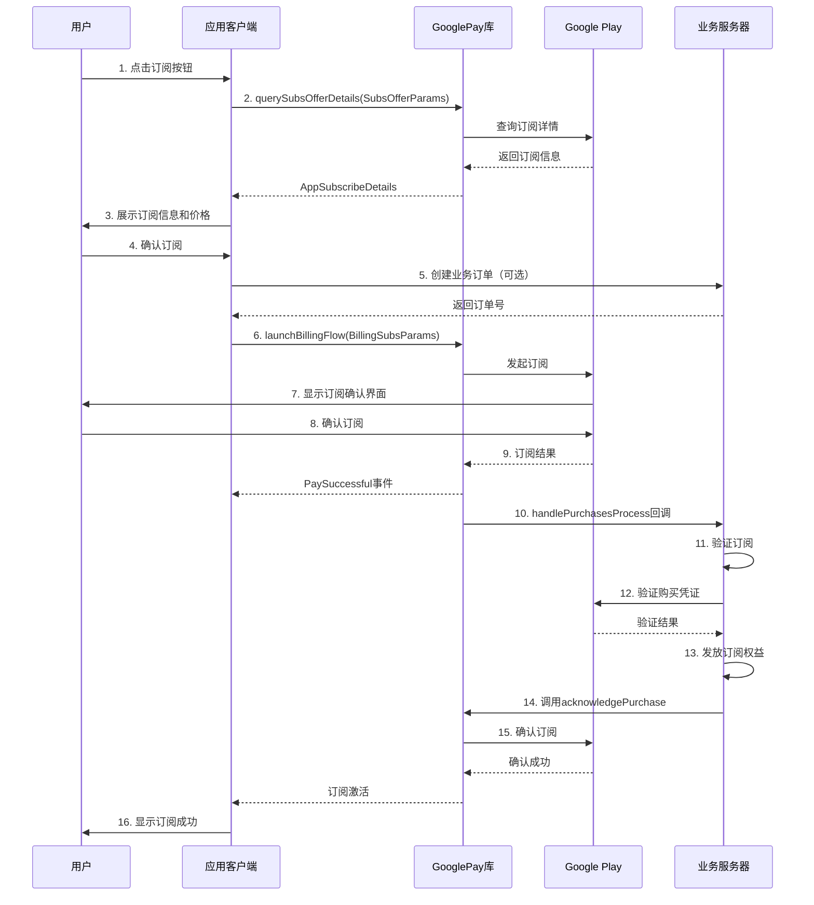
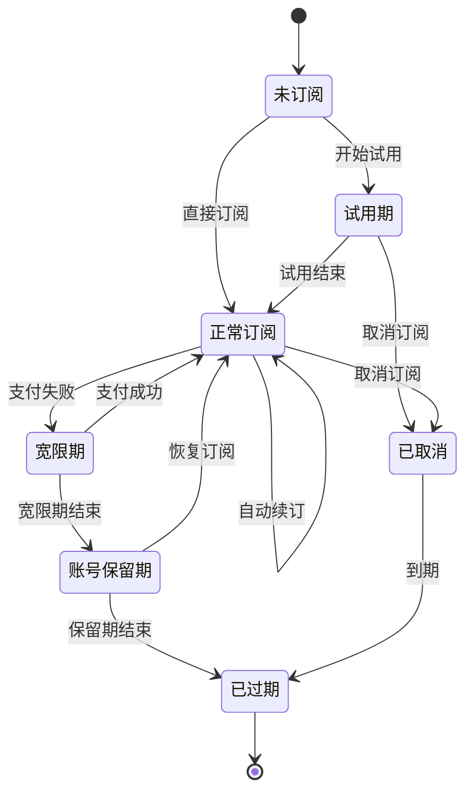

# GooglePay 订阅商品购买流程

本文档详细介绍如何使用 GooglePay 库实现订阅商品的完整购买流程。

## 1. 概述

### 1.1 什么是订阅商品

订阅商品是指用户按周期（如每月、每年）付费的商品，会自动续订直到用户取消。常见的订阅商品包括：

- VIP 会员
- 高级功能订阅
- 内容订阅（音乐、视频、新闻等）
- 云存储空间
- 去广告服务

### 1.2 订阅商品的特点

- **自动续订**: 到期后自动续费，除非用户主动取消
- **周期性**: 按固定周期收费（周、月、季、年等）
- **需要确认**: 购买成功后必须调用 `acknowledgePurchase` 确认
- **支持优惠**: 可以设置试用期、介绍价格等优惠
- **状态管理**: 需要管理订阅的有效期、暂停、恢复等状态

### 1.3 订阅模式

GooglePay 库支持两种订阅模式：

| 模式 | 说明 | 适用场景 |
|------|------|----------|
| **SingleMode** | 单订阅模式，用户同时只能拥有一个订阅 | 会员等级系统（普通会员、VIP、SVIP） |
| **MultiModal** | 多订阅模式，用户可以同时拥有多个订阅 | 多个独立功能订阅 |

## 2. 前置准备

### 2.1 Google Play Console 配置

#### 创建订阅商品

1. 登录 [Google Play Console](https://play.google.com/console)
2. 选择您的应用
3. 导航到 **订阅** → **创建订阅**
4. 填写订阅基本信息：
   - **订阅 ID**: 唯一标识符（例如：`monthly_vip`）
   - **名称**: 订阅显示名称
   - **说明**: 订阅描述

#### 配置 Base Plan（基础方案）

每个订阅至少需要一个 Base Plan：

1. 点击 **添加基础方案**
2. 设置 **Base Plan ID**（例如：`monthly-plan`）
3. 选择 **续订类型**: 自动续订
4. 设置 **计费周期**: 每月、每年等
5. 设置 **价格**: 各个国家/地区的价格

#### 配置 Offer（优惠）（可选）

可以为 Base Plan 添加优惠：

1. 在 Base Plan 中点击 **添加优惠**
2. 设置 **Offer ID**（例如：`trial-7days`）
3. 选择优惠类型：
   - **免费试用**: 免费使用一段时间
   - **介绍价格**: 首次订阅享受优惠价格
   - **促销价格**: 限时优惠
4. 设置优惠详情和价格

### 2.2 应用初始化配置

在 `Application` 类中初始化 GooglePayClient：

```kotlin
class App : Application(), GooglePayService {
    
    override fun onCreate() {
        super.onCreate()
        
        GooglePayClient.getInstance()
            .initBillingClient(this, this)
            .setDebug(true)  // 开发环境开启调试日志
            .setSubscription(true)  // 支持订阅
            .setSubscriptionMode(SubscriptionMode.SingleMode)  // 单订阅模式
            .setInterval(15)  // 自动刷新间隔 15 秒
            .registerActivitys(listOf(MainActivity::class.java))
    }
    
    // 实现 GooglePayService 接口
    override fun getOneTimeConsumableProducts(): List<String> {
        return emptyList()  // 不支持消耗型商品
    }
    
    override fun getOneTimeNonConsumableProducts(): List<String> {
        return emptyList()
    }
    
    override fun getSubscribeProducts(): List<String> {
        return listOf(
            "monthly_vip",
            "yearly_vip"
        )
    }
    
    override fun handlePurchasesProcess(
        isPay: Boolean,
        productType: BillingProductType,
        purchases: Purchase
    ) {
        // 处理订阅验证逻辑（见后续章节）
    }
}
```

## 3. 完整购买流程

### 流程图



### 步骤 1: 查询订阅详情

在展示订阅列表前，需要先查询订阅的详细信息（价格、优惠等）。

```kotlin
class SubscriptionViewModel : ViewModel() {
    
    private val subscriptionService = GooglePayClient.getInstance()
        .getPayService<SubscriptionService>()
    
    private val _subscriptions = MutableLiveData<List<SubscriptionData>>()
    val subscriptions: LiveData<List<SubscriptionData>> = _subscriptions
    
    fun loadSubscriptions() {
        viewModelScope.launch {
            // 1. 构建查询参数
            val params = SubsOfferParams.Builder()
                .setProductIds(listOf("monthly_vip", "yearly_vip"))
                .build()
            
            // 2. 查询订阅详情
            subscriptionService.querySubsOfferDetails(params).collect { result ->
                result.onSuccess { subscriptionList ->
                    // 3. 处理订阅数据
                    val data = subscriptionList.map { subscription ->
                        SubscriptionData(
                            productId = subscription.productId,
                            productName = subscription.productName,
                            basePlanId = extractBasePlanId(subscription),
                            offerId = extractOfferId(subscription),
                            pricingPhases = subscription.pricingPhases
                        )
                    }
                    _subscriptions.value = data
                    Log.d("Subs", "加载成功: ${data.size} 个订阅")
                }
                result.onFailure { error ->
                    Log.e("Subs", "加载失败: ${error.message}")
                }
            }
        }
    }
    
    private fun extractBasePlanId(subscription: AppSubscribeDetails): String {
        // 从订阅详情中提取 basePlanId
        // 实际实现需要根据库的具体 API
        return "monthly-plan"
    }
    
    private fun extractOfferId(subscription: AppSubscribeDetails): String? {
        // 从订阅详情中提取 offerId（如果有优惠）
        return null
    }
}

data class SubscriptionData(
    val productId: String,
    val productName: String,
    val basePlanId: String,
    val offerId: String?,
    val pricingPhases: List<PricingPhase>
)
```

**AppSubscribeDetails 字段说明:**

| 字段 | 类型 | 说明 |
|------|------|------|
| `productId` | String | 订阅商品 ID |
| `productName` | String | 订阅商品名称 |
| `pricingPhases` | List&lt;PricingPhase&gt; | 定价阶梯列表 |

**PricingPhase 字段说明:**

| 字段 | 类型 | 说明 |
|------|------|------|
| `formattedPrice` | String | 格式化的价格（如 "€7.99"） |
| `priceAmountMicros` | Long | 价格的微单位值 |
| `priceCurrencyCode` | String | 货币代码（如 "EUR"） |

### 步骤 2: 发起订阅购买

用户点击订阅按钮后，构建订阅参数并发起订阅流程。

```kotlin
class SubsFragment : Fragment() {
    
    private val subscriptionService = GooglePayClient.getInstance()
        .getPayService<SubscriptionService>()
    
    private fun onSubscriptionClick(subscription: SubscriptionData) {
        lifecycleScope.launch {
            try {
                // 1. 可选：向业务服务器创建订单
                val chargeNo = createBusinessOrder(subscription.productId)
                
                // 2. 构建订阅参数
                val params = BillingSubsParams.Builder()
                    .setAccountId("user_12345")  // 用户唯一标识
                    .setProductId(subscription.productId)  // 订阅商品 ID
                    .setChargeNo(chargeNo)  // 业务订单号（可选）
                    .setBasePlanId(subscription.basePlanId)  // Base Plan ID
                    .setOfferId(subscription.offerId)  // Offer ID（如果有优惠）
                    .build()
                
                // 3. 发起订阅
                val result = subscriptionService.launchBillingFlow(
                    requireActivity(),
                    params
                )
                
                // 4. 处理返回结果
                when (result.code) {
                    AppBillingResponseCode.OK -> {
                        Log.d("Subs", "订阅流程已启动")
                    }
                    AppBillingResponseCode.USER_CANCELED -> {
                        showToast("您取消了订阅")
                    }
                    AppBillingResponseCode.ITEM_ALREADY_OWNED -> {
                        showToast("您已订阅该商品")
                        // 可以查询当前订阅状态
                        queryCurrentSubscription()
                    }
                    else -> {
                        showToast("订阅失败: ${result.message}")
                    }
                }
                
            } catch (e: Exception) {
                showToast("订阅失败: ${e.message}")
            }
        }
    }
    
    private suspend fun createBusinessOrder(productId: String): String {
        return withContext(Dispatchers.IO) {
            // 调用业务服务器 API 创建订单
            "SUB_ORDER_${System.currentTimeMillis()}"
        }
    }
}
```

**BillingSubsParams 参数说明:**

| 参数 | 类型 | 必填 | 说明 |
|------|------|------|------|
| `accountId` | String | 是 | 用户唯一标识 |
| `productId` | String | 是 | 订阅商品 ID |
| `chargeNo` | String | 否 | 业务订单号 |
| `basePlanId` | String | 是 | Base Plan ID |
| `offerId` | String | 否 | Offer ID（有优惠时必填） |

### 步骤 3: 监听支付事件

使用 `observePayEvent` 监听订阅结果。

```kotlin
class SubsFragment : Fragment() {
    
    override fun onViewCreated(view: View, savedInstanceState: Bundle?) {
        super.onViewCreated(view, savedInstanceState)
        
        // 监听支付事件
        observePayEvent { event ->
            when (event) {
                is BillingPayEvent.PaySuccessful -> {
                    // 订阅成功
                    Log.d("Subs", "订阅成功: ${event.purchase.orderId}")
                    showLoading("正在激活订阅...")
                    
                    // 注意：订阅商品不会触发 PayConsumeSuccessful
                    // 需要在服务端验证后手动确认
                }
                
                is BillingPayEvent.PayFailed -> {
                    // 订阅失败
                    hideLoading()
                    showToast("订阅失败: ${event.message}")
                    Log.e("Subs", "订阅失败: code=${event.code}, msg=${event.message}")
                }
                
                is BillingPayEvent.PayConsumeSuccessful -> {
                    // 订阅商品不会触发此事件
                }
                
                is BillingPayEvent.PayConsumeFailed -> {
                    // 订阅商品不会触发此事件
                }
            }
        }
    }
}
```

### 步骤 4: 服务端验证和确认

在 `GooglePayService.handlePurchasesProcess()` 中实现订阅验证和确认逻辑。

```kotlin
class App : Application(), GooglePayService {
    
    override fun handlePurchasesProcess(
        isPay: Boolean,
        productType: BillingProductType,
        purchases: Purchase
    ) {
        // 检查是否是订阅商品
        if (productType != BillingProductType.SUBS) return
        
        // 在后台线程处理
        CoroutineScope(Dispatchers.IO).launch {
            try {
                // 1. 提取订单信息
                val productId = purchases.products.firstOrNull() ?: return@launch
                val purchaseToken = purchases.purchaseToken
                val orderId = purchases.orderId
                val accountId = purchases.accountIdentifiers?.obfuscatedAccountId
                
                Log.d("Subscription", "处理订阅: orderId=$orderId, productId=$productId")
                
                // 2. 检查是否已确认
                if (purchases.isAcknowledged) {
                    Log.d("Subscription", "订阅已确认，跳过处理")
                    return@launch
                }
                
                // 3. 调用业务服务器验证订阅
                val verifyResult = verifySubscriptionOnServer(
                    productId = productId,
                    purchaseToken = purchaseToken,
                    orderId = orderId,
                    accountId = accountId
                )
                
                if (verifyResult.success) {
                    // 4. 验证成功，发放订阅权益
                    Log.d("Subscription", "订阅验证成功，正在确认...")
                    
                    // 5. 确认订阅（重要！）
                    acknowledgePurchase(purchases)
                    
                } else {
                    Log.e("Subscription", "订阅验证失败: ${verifyResult.message}")
                }
                
            } catch (e: Exception) {
                Log.e("Subscription", "处理订阅异常", e)
            }
        }
    }
    
    private suspend fun acknowledgePurchase(purchase: Purchase) {
        withContext(Dispatchers.IO) {
            try {
                // 调用 Google Play Billing API 确认订阅
                val billingClient = GooglePayClient.getInstance().getBillingClient()
                val params = AcknowledgePurchaseParams.newBuilder()
                    .setPurchaseToken(purchase.purchaseToken)
                    .build()
                
                val result = billingClient.acknowledgePurchase(params)
                
                if (result.responseCode == BillingClient.BillingResponseCode.OK) {
                    Log.d("Subscription", "订阅确认成功")
                    // 通知用户订阅已激活
                    notifySubscriptionActivated()
                } else {
                    Log.e("Subscription", "订阅确认失败: ${result.debugMessage}")
                }
                
            } catch (e: Exception) {
                Log.e("Subscription", "确认订阅异常", e)
            }
        }
    }
    
    private suspend fun verifySubscriptionOnServer(
        productId: String,
        purchaseToken: String,
        orderId: String?,
        accountId: String?
    ): VerifyResult {
        return withContext(Dispatchers.IO) {
            // 调用业务服务器 API 验证订阅
            // 服务器应该：
            // 1. 验证 purchaseToken 的有效性（调用 Google Play Developer API）
            // 2. 检查订阅是否已经处理过
            // 3. 发放订阅权益给用户
            // 4. 返回验证结果
            
            val response = apiService.verifySubscription(
                productId, purchaseToken, orderId, accountId
            )
            VerifyResult(response.success, response.message)
        }
    }
    
    private fun notifySubscriptionActivated() {
        // 发送通知或事件，告知用户订阅已激活
    }
    
    data class VerifyResult(val success: Boolean, val message: String)
}
```

### 步骤 5: 查询当前订阅状态

查询用户当前有效的订阅。

```kotlin
class SubscriptionViewModel : ViewModel() {
    
    private val subscriptionService = GooglePayClient.getInstance()
        .getPayService<SubscriptionService>()
    
    private val _activeSubscriptions = MutableLiveData<List<Purchase>>()
    val activeSubscriptions: LiveData<List<Purchase>> = _activeSubscriptions
    
    fun queryActiveSubscriptions() {
        viewModelScope.launch {
            // 查询当前有效的订阅
            subscriptionService.queryAckSubscribePurchases(null).collect { result ->
                result.onSuccess { purchases ->
                    _activeSubscriptions.value = purchases
                    Log.d("Subs", "当前有效订阅: ${purchases.size} 个")
                    
                    purchases.forEach { purchase ->
                        Log.d("Subs", "订阅: ${purchase.products.firstOrNull()}")
                        Log.d("Subs", "订单ID: ${purchase.orderId}")
                        Log.d("Subs", "是否已确认: ${purchase.isAcknowledged}")
                    }
                }
                result.onFailure { error ->
                    Log.e("Subs", "查询失败: ${error.message}")
                }
            }
        }
    }
    
    fun checkSubscriptionStatus(productId: String): Boolean {
        // 检查用户是否订阅了指定商品
        return activeSubscriptions.value?.any { purchase ->
            purchase.products.contains(productId) && purchase.isAcknowledged
        } ?: false
    }
}
```

## 4. 订阅管理

### 4.1 升级/降级订阅

在单订阅模式下，用户可以升级或降级订阅。

```kotlin
fun upgradeSubscription(
    oldProductId: String,
    newProductId: String,
    newBasePlanId: String
) {
    lifecycleScope.launch {
        // 1. 查询当前订阅
        val currentPurchase = findCurrentPurchase(oldProductId)
        
        if (currentPurchase == null) {
            showToast("未找到当前订阅")
            return@launch
        }
        
        // 2. 构建升级参数
        val params = BillingSubsParams.Builder()
            .setAccountId("user_12345")
            .setProductId(newProductId)
            .setBasePlanId(newBasePlanId)
            .setOldPurchaseToken(currentPurchase.purchaseToken)  // 关键：传入旧订阅的 token
            .build()
        
        // 3. 发起升级
        val result = subscriptionService.launchBillingFlow(
            requireActivity(),
            params
        )
        
        if (result.code == AppBillingResponseCode.OK) {
            showToast("正在升级订阅...")
        }
    }
}

private suspend fun findCurrentPurchase(productId: String): Purchase? {
    // 查询当前订阅
    var purchase: Purchase? = null
    subscriptionService.queryAckSubscribePurchases(null).collect { result ->
        result.onSuccess { purchases ->
            purchase = purchases.find { it.products.contains(productId) }
        }
    }
    return purchase
}
```

### 4.2 取消订阅

用户需要在 Google Play 中取消订阅，应用可以引导用户：

```kotlin
fun navigateToSubscriptionManagement() {
    try {
        val intent = Intent(Intent.ACTION_VIEW).apply {
            data = Uri.parse("https://play.google.com/store/account/subscriptions")
        }
        startActivity(intent)
    } catch (e: Exception) {
        showToast("无法打开订阅管理页面")
    }
}
```

### 4.3 订阅状态检查

定期检查订阅状态，处理过期、暂停等情况。

```kotlin
fun checkAndUpdateSubscriptionStatus() {
    lifecycleScope.launch {
        subscriptionService.queryAckSubscribePurchases(null).collect { result ->
            result.onSuccess { purchases ->
                if (purchases.isEmpty()) {
                    // 用户没有有效订阅
                    updateUserSubscriptionStatus(false)
                } else {
                    // 用户有有效订阅
                    updateUserSubscriptionStatus(true)
                    
                    // 检查订阅详情
                    purchases.forEach { purchase ->
                        checkPurchaseDetails(purchase)
                    }
                }
            }
        }
    }
}

private fun checkPurchaseDetails(purchase: Purchase) {
    // 检查订阅是否在宽限期
    // 检查订阅是否在账号保留期
    // 这些信息需要通过 Google Play Developer API 在服务端查询
}
```

## 5. 完整代码示例

### Fragment 完整实现

```kotlin
class SubsFragment : Fragment() {
    
    private var _binding: FragmentSubsBinding? = null
    private val binding get() = _binding!!
    
    private val viewModel by viewModels<SubsViewModel>()
    private val adapter = SubscriptionAdapter()
    
    private val subscriptionService = GooglePayClient.getInstance()
        .getPayService<SubscriptionService>()
    
    override fun onCreateView(
        inflater: LayoutInflater,
        container: ViewGroup?,
        savedInstanceState: Bundle?
    ): View {
        _binding = FragmentSubsBinding.inflate(inflater, container, false)
        return binding.root
    }
    
    override fun onViewCreated(view: View, savedInstanceState: Bundle?) {
        super.onViewCreated(view, savedInstanceState)
        
        setupRecyclerView()
        observeSubscriptions()
        observePayEvents()
        
        // 加载订阅列表
        viewModel.loadSubscriptions()
        
        // 查询当前订阅状态
        viewModel.queryActiveSubscriptions()
    }
    
    private fun setupRecyclerView() {
        binding.recyclerView.apply {
            layoutManager = GridLayoutManager(requireContext(), 2)
            adapter = this@SubsFragment.adapter
        }
        
        adapter.setOnItemClickListener { subscription ->
            purchaseSubscription(subscription)
        }
    }
    
    private fun observeSubscriptions() {
        viewModel.subscriptions.observe(viewLifecycleOwner) { subscriptions ->
            adapter.submitList(subscriptions)
        }
        
        viewModel.activeSubscriptions.observe(viewLifecycleOwner) { purchases ->
            updateSubscriptionStatus(purchases)
        }
    }
    
    private fun observePayEvents() {
        observePayEvent { event ->
            when (event) {
                is BillingPayEvent.PaySuccessful -> {
                    showLoading("正在激活订阅...")
                }
                
                is BillingPayEvent.PayFailed -> {
                    hideLoading()
                    showToast("订阅失败: ${event.message}")
                }
                
                else -> {
                    // 订阅商品不会触发消耗相关事件
                }
            }
        }
    }
    
    private fun purchaseSubscription(subscription: SubscriptionData) {
        lifecycleScope.launch {
            try {
                val params = BillingSubsParams.Builder()
                    .setAccountId(viewModel.getUserId())
                    .setProductId(subscription.productId)
                    .setBasePlanId(subscription.basePlanId)
                    .setOfferId(subscription.offerId)
                    .build()
                
                val result = subscriptionService.launchBillingFlow(
                    requireActivity(),
                    params
                )
                
                if (result.code != AppBillingResponseCode.OK) {
                    showToast(result.message)
                }
                
            } catch (e: Exception) {
                showToast("订阅失败: ${e.message}")
            }
        }
    }
    
    private fun updateSubscriptionStatus(purchases: List<Purchase>) {
        // 更新 UI 显示订阅状态
        binding.subscriptionStatus.text = if (purchases.isNotEmpty()) {
            "已订阅"
        } else {
            "未订阅"
        }
    }
    
    override fun onDestroyView() {
        super.onDestroyView()
        _binding = null
    }
}
```

### ViewModel 实现

```kotlin
class SubsViewModel : ViewModel() {
    
    private val subscriptionService = GooglePayClient.getInstance()
        .getPayService<SubscriptionService>()
    
    private val _subscriptions = MutableLiveData<List<SubscriptionData>>()
    val subscriptions: LiveData<List<SubscriptionData>> = _subscriptions
    
    private val _activeSubscriptions = MutableLiveData<List<Purchase>>()
    val activeSubscriptions: LiveData<List<Purchase>> = _activeSubscriptions
    
    fun loadSubscriptions() {
        viewModelScope.launch {
            val params = SubsOfferParams.Builder()
                .setProductIds(listOf("monthly_vip", "yearly_vip"))
                .build()
            
            subscriptionService.querySubsOfferDetails(params).collect { result ->
                result.onSuccess { list ->
                    val data = list.map { sub ->
                        SubscriptionData(
                            productId = sub.productId,
                            productName = sub.productName,
                            basePlanId = "monthly-plan",  // 实际需要从订阅详情中提取
                            offerId = null,
                            pricingPhases = sub.pricingPhases
                        )
                    }
                    _subscriptions.value = data
                }
                result.onFailure { Log.e("VM", "加载失败", it) }
            }
        }
    }
    
    fun queryActiveSubscriptions() {
        viewModelScope.launch {
            subscriptionService.queryAckSubscribePurchases(null).collect { result ->
                result.onSuccess { _activeSubscriptions.value = it }
                result.onFailure { Log.e("VM", "查询失败", it) }
            }
        }
    }
    
    fun getUserId(): String {
        return "user_12345"
    }
}
```

## 6. 订阅生命周期



## 7. 常见问题

### Q1: 订阅模式如何选择？

**A**:

- **SingleMode**: 适用于会员等级系统，用户只能同时拥有一个订阅（如普通会员、VIP、SVIP）
- **MultiModal**: 适用于多个独立功能订阅，用户可以同时订阅多个（如去广告 + 云存储）

### Q2: 如何获取 Offer Token？

**A**:

- Offer Token 在查询订阅详情时返回
- 需要从 `AppSubscribeDetails` 中提取
- 如果没有优惠，可以不设置 `offerId`

### Q3: 订阅确认失败怎么办？

**A**:

- 用户下次启动应用时，库会自动重新查询未确认的订阅
- 在 `handlePurchasesProcess` 中会再次触发确认流程
- 建议在服务端记录确认状态

### Q4: 如何处理订阅冲突？

**A**:

- 在 SingleMode 下，购买新订阅会自动替换旧订阅
- 需要传入旧订阅的 `purchaseToken` 进行升级/降级
- Google Play 会自动处理退款和计费

### Q5: 宽限期和账号保留期是什么？

**A**:

- **宽限期**: 支付失败后，给用户一段时间更新支付方式，期间仍可使用订阅
- **账号保留期**: 宽限期结束后，暂停订阅但保留用户数据，等待用户恢复订阅
- 这些状态需要通过 Google Play Developer API 在服务端查询

### Q6: 如何测试订阅？

**A**:

1. 在 Google Play Console 中添加测试账号
2. 使用测试账号登录设备
3. 测试订阅会加速到期（如月订阅变为 5 分钟）
4. 可以测试续订、取消、恢复等流程

## 8. 最佳实践

1. **服务端验证**: 始终在服务端验证订阅凭证，不要仅依赖客户端
2. **及时确认**: 订阅成功后必须在 3 天内确认，否则会自动退款
3. **状态同步**: 定期查询订阅状态，保持客户端和服务端状态一致
4. **优雅降级**: 订阅过期后，优雅地降级用户权益，引导续订
5. **用户引导**: 提供清晰的订阅管理入口，方便用户查看和管理订阅
6. **错误处理**: 完善的错误处理和用户提示
7. **测试**: 充分测试各种场景（新订阅、续订、升级、降级、取消等）

## 9. 相关文档

- [API 文档](./API_DOCS.zh_CN.md)
- [消耗商品购买流程](./消耗商品购买流程.md)
- [Google Play Billing 订阅文档](https://developer.android.com/google/play/billing/subscriptions)
